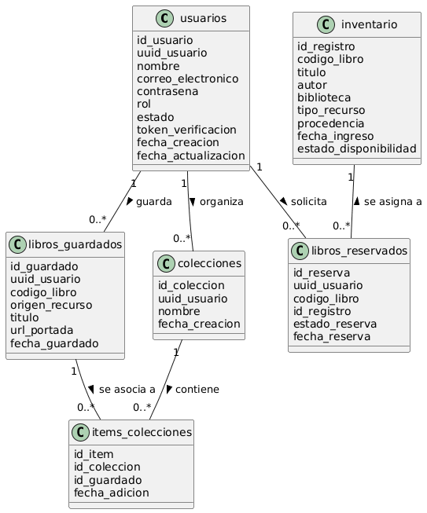
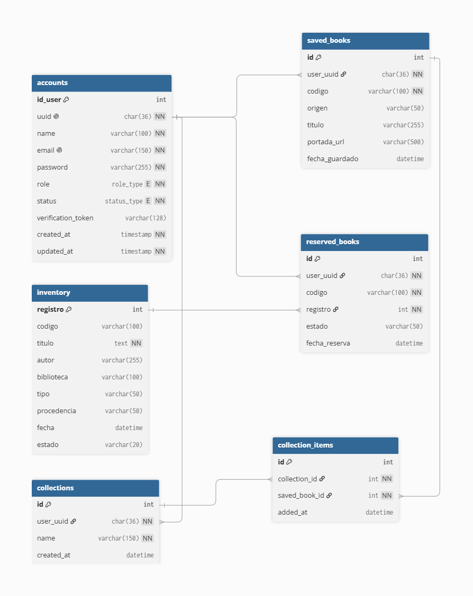

**UNIVERSIDAD PRIVADA DE TACNA**

**FACULTAD DE INGENIERÍA**

**Escuela Profesional de Ingeniería de Sistemas**

#  **Sistema NexusLib**

Curso: Patrones de Software

Docente: Ing. Patrick Cuadros Quiroga

Integrantes:

***Hurtado Ortiz, Leandro Diego		(2015052384)***  
***Flores Navarro, Eduardo Gino		(2023076793)***  
***Cortez Mamani, Julio Samuel		(2023077283)***

**Tacna – Perú**  
**2026**

# **Sistema NexusLib**

# **Diccionario de Datos**

# 

# **Versión 2.0**

**ÍNDICE GENERAL**

Contenido

[**1\. Modelo Entidad / relación	4**](#1.-modelo-entidad-/-relación)

[1.1. Diseño lógico	4](#1.1.-diseño-lógico)

[1.2. Diseño Físico	4](#1.2.-diseño-físico)

[**2\. DICCIONARIO DE DATOS	5**](#2.-diccionario-de-datos)

[2.1. Tablas	5](#2.1.-tablas)

[Tabla: accounts	5](#tabla:-accounts)

[Tabla: inventory	7](#tabla:-inventory)

[Tabla: saved\_books	8](#tabla:-saved_books)

[Tabla: reserved\_books	10](#tabla:-reserved_books)

[Tabla: collections	11](#tabla:-collections)

[Tabla: collection\_items	12](#tabla:-collection_items)

[2.2. Lenguaje de Definición de Datos (DDL)	13](#2.2.-lenguaje-de-definición-de-datos-\(ddl\))

[2.3. Lenguaje de Manipulación de Datos (DML)	15](#2.3.-lenguaje-de-manipulación-de-datos-\(dml\))

**Diccionario de Datos**

# **1\. Modelo Entidad / relación** {#1.-modelo-entidad-/-relación}

## **1.1. Diseño lógico** {#1.1.-diseño-lógico}



## 1.2. **Diseño Físico** {#1.2.-diseño-físico}



# **2\. DICCIONARIO DE DATOS** {#2.-diccionario-de-datos}

## **2.1. Tablas** {#2.1.-tablas}

### **Tabla: accounts** {#tabla:-accounts}

| Nombre de la Tabla: | accounts |
| ----- | ----- |
| Nombres de la Tabla: | Cuentas de Usuarios |
| Descripción de la Tabla: | Almacena la información de identidad, credenciales y estado de autenticación de todos los usuarios (usuarios generales y administradores) de la plataforma NexusLib. |
| Objetivo: | Administrar el control de acceso del sistema, la asignación de roles y proveer el identificador único universal (UUID) que asocia las acciones del usuario en los demás microservicios de forma desacoplada. |
| Relaciones con otras tablas: | Relacionada de manera lógica con las tablas saved\_books y reserved\_books mediante el campo común uuid. |

| Nr. | Nombre del campo | Tipo de dato | Longitud | Permite nulos | Clave primaria | Clave foránea | Descripción del campo |
| :---- | :---- | :---- | :---- | :---- | :---- | :---- | :---- |
| 1 | id\_user | INT | 11 | No | Sí | No | Identificador numérico correlativo autoincremental de control interno en el servicio de autenticación. |
| 2 | uuid | CHAR | 36 | No | No | No | Identificador Único Universal (UUIDv4) generado por software para relacionar al usuario entre microservicios de manera lógica. |
| 3 | name | VARCHAR | 100 | No | No | No | Nombres y apellidos completos del usuario registrado en la plataforma. |
| 4 | email | VARCHAR | 150 | No | No | No | Dirección de correo electrónico institucional única asociada a la cuenta del usuario. |
| 5 | password | VARCHAR | 255 | No | No | No | Contraseña de acceso al sistema encriptada mediante el algoritmo seguro de hash BCrypt. |
| 6 | role | ENUM | \- | No | No | No | Rol asignado en el sistema para control de accesos ('user' para usuarios, 'admin' para administradores). |
| 7 | status | ENUM | \- | No | No | No | Estado operativo de la cuenta de usuario ('active' para validados, 'inactive' para cuentas pendientes). |
| 8 | verification\_token | VARCHAR | 128 | Sí | No | No | Token temporal aleatorio utilizado para el proceso de verificación de identidad por correo electrónico. |
| 9 | created\_at | TIMESTAMP | \- | No | No | No | Fecha y hora exacta en la que se realizó el registro inicial de la cuenta en el sistema. |
| 10 | updated\_at | TIMESTAMP | \- | No | No | No | Fecha y hora de la última modificación o actualización de datos realizada sobre el registro. |

### **Tabla: inventory** {#tabla:-inventory}

| Nombre de la Tabla: | inventory |
| ----- | ----- |
| Nombres de la Tabla: | Inventario de Libros |
| Descripción de la Tabla: | Almacena los metadatos detallados y el estado físico de los ejemplares disponibles en las estanterías de la biblioteca universitaria. |
| Objetivo: | Controlar el catálogo de textos físicos, su procedencia, clasificación y gestionar el estado de disponibilidad para los procesos de reserva de los alumnos. |
| Relaciones con otras tablas: | Relacionada de manera lógica con la tabla reserved\_books mediante el campo común registro. |

| Nr. | Nombre del campo | Tipo de dato | Longitud | Permite nulos | Clave primaria | Clave foránea | Descripción del campo |
| :---- | :---- | :---- | :---- | :---- | :---- | :---- | :---- |
| 1 | registro | INT | 11 | No | Sí | No | Identificador numérico único de control físico asignado individualmente a cada ejemplar en estantería. |
| 2 | codigo | VARCHAR | 100 | Sí | No | No | Código de barras o sistema de catalogación general del texto dentro de la biblioteca. |
| 3 | titulo | TEXT | \- | No | No | No | Título completo oficial del recurso bibliográfico o libro. |
| 4 | autor | VARCHAR | 255 | Sí | No | No | Nombre del autor o autores responsables de la creación de la obra. |
| 5 | biblioteca | VARCHAR | 100 | Sí | No | No | Nombre o código de la biblioteca física institucional de la universidad donde se ubica el ejemplar. |
| 6 | tipo | VARCHAR | 50 | Sí | No | No | Categoría o formato del elemento físico indexado (ej. Libro, Tesis, Revista). |
| 7 | procedencia | VARCHAR | 50 | Sí | No | No | Origen del recurso físico dentro de la institución (ej. Donación, Compra Directa). |
| 8 | fecha | DATETIME | \- | Sí | No | No | Fecha y hora en la que se ingresó o registró físicamente el elemento en el catálogo general. |
| 9 | estado | VARCHAR | 20 | Sí | No | No | Estado de disponibilidad en tiempo real del ejemplar (Predeterminado: 'Disponible'). |

### **Tabla: saved\_books** {#tabla:-saved_books}

| Nombre de la Tabla: | saved\_books |
| ----- | ----- |
| Nombres de la Tabla: | Libros Guardados / Favoritos |
| Descripción de la Tabla: | Registra las colecciones personalizadas de marcadores y favoritos digitales que los usuarios estructuran dentro de su sesión. |
| Objetivo: | Permitir al usuario almacenar referencias rápidas a libros digitales extraídos de fuentes externas como Alpha Cloud o e-Libro para lecturas posteriores. |
| Relaciones con otras tablas: | Relacionada de manera lógica con la tabla accounts mediante el campo user\_uuid. |

| Nr. | Nombre del campo | Tipo de dato | Longitud | Permite nulos | Clave primaria | Clave foránea | Descripción del campo |
| :---- | :---- | :---- | :---- | :---- | :---- | :---- | :---- |
| 1 | id | INT | 11 | No | Sí | No | Identificador numérico correlativo autoincremental único de control de favoritos. |
| 2 | user\_uuid | CHAR | 36 | No | No | Sí (accounts) | UUID del usuario proveniente del microservicio de autenticación que actúa como enlace lógico. |
| 3 | codigo | VARCHAR | 100 | No | No | No | Código general del libro o ID de persistencia único extraído desde los scrapers digitales externos. |
| 4 | origen | VARCHAR | 50 | Sí | No | No | Identificador de la plataforma digital externa de procedencia (ej. 'Alpha Cloud', 'e-Libro'). |
| 5 | titulo | VARCHAR | 255 | Sí | No | No | Título del libro digital capturado por los servicios de extracción al momento de guardarse. |
| 6 | portada\_url | VARCHAR | 500 | Sí | No | No | Enlace web o URL absoluta de la imagen de portada del libro para la renderización en el frontend. |
| 7 | fecha\_guardado | DATETIME | \- | Sí | No | No | Fecha y hora del servidor en la que el usuario incorporó el recurso a su colección personal de favoritos. |

### **Tabla: reserved\_books** {#tabla:-reserved_books}

| Nombre de la Tabla: | reserved\_books |
| ----- | ----- |
| Nombres de la Tabla: | Libros Reservados / Apartados |
| Descripción de la Tabla: | Gestiona las solicitudes activas de separación y el historial de apartados de libros físicos que los alumnos realizan sobre el inventario. |
| Objetivo: | Orquestar el flujo transaccional de préstamos temporales, protegiendo que un mismo ejemplar físico no sea reservado de forma simultánea. |
| Relaciones con otras tablas: | Relacionada de manera lógica con la tabla accounts mediante user\_uuid y con inventory mediante registro. |

| Nr. | Nombre del campo | Tipo de dato | Longitud | Permite nulos | Clave primaria | Clave foránea | Descripción del campo |
| :---- | :---- | :---- | :---- | :---- | :---- | :---- | :---- |
| 1 | id | INT | 11 | No | Sí | No | Identificador numérico correlativo autoincremental único de control de reservas en el sistema. |
| 2 | user\_uuid | CHAR | 36 | No | No | Sí (accounts) | UUID del usuario que genera el apartado, mapeado lógicamente desde el auth-service. |
| 3 | codigo | VARCHAR | 100 | No | No | No | Código bibliográfico o signatura topográfica de catalogación general del libro reservado. |
| 4 | registro | INT | 11 | No | No | Sí (inventory) | Número de registro del ejemplar físico específico apartado, sirviendo como enlace lógico con el inventario. |
| 5 | estado | VARCHAR | 50 | Sí | No | No | Estado operativo del trámite de la reserva (ej. 'Pendiente', 'Entregado', 'Cancelado'). |
| 6 | fecha\_reserva | DATETIME | \- | Sí | No | No | Fecha y hora del servidor en la que se consolidó de manera exitosa la solicitud de separación física. |

### **Tabla: collections** {#tabla:-collections}

| Nombre de la Tabla: | collections |
| :---- | :---- |
| **Nombres de la Tabla:** | Colecciones Personalizadas / Carpetas |
| **Descripción de la Tabla:** | Almacena la estructura de las carpetas o agrupaciones creadas de forma personalizada por los usuarios para organizar sus marcadores bibliográficos. |
| **Objetivo:** | Proporcionar la capacidad de categorizar y segmentar los libros favoritos en el Dashboard según las necesidades académicas individuales de cada alumno de manera desacoplada. |
| **Relaciones con otras tablas:** | Relacionada de manera lógica con la tabla accounts mediante el campo user\_uuid, y con la tabla intermedia collection\_items mediante su clave primaria id. |

| Nr. | Nombre del campo | Tipo de dato | Longitud | Permite nulos | Clave primaria | Clave foránea | Descripción del campo |
| :---- | :---- | :---- | :---- | :---- | :---- | :---- | :---- |
| **1** | id | INT | 11 | No | Sí | No | Identificador numérico correlativo autoincremental de control interno de la colección. |
| **2** | user\_uuid | CHAR | 36 | No | No | Sí (accounts) | UUID del propietario de la colección, utilizado como enlace lógico entre microservicios. |
| **3** | name | VARCHAR | 150 | No | No | No | Nombre descriptivo asignado por el usuario para rotular su carpeta personalizada. |
| **4** | created\_at | DATETIME | \- | Sí | No | No | Fecha y hora del servidor en la que el usuario registró la nueva colección. |

### **Tabla: collection\_items** {#tabla:-collection_items}

| Nombre de la Tabla: | collection\_items |
| :---- | :---- |
| **Nombres de la Tabla:** | Ítems de Colecciones / Enlaces Relacionales |
| **Descripción de la Tabla:** | Tabla asociativa intermedia encargada de romper la relación de muchos a muchos ($M:N$) existente entre las carpetas personalizadas y los libros guardados. |
| **Objetivo:** | Gestionar el catálogo interno de recursos vinculados a cada carpeta, asegurando la integridad referencial y aplicando restricciones de unicidad complejas para evitar la duplicidad de un libro en una misma colección. |
| **Relaciones con otras tablas:** | Relacionada de manera lógica con la tabla collections mediante collection\_id y con la tabla saved\_books a través del campo común saved\_book\_id. |

| Nr. | Nombre del campo | Tipo de dato | Longitud | Permite nulos | Clave primaria | Clave foránea | Descripción del campo |
| :---- | :---- | :---- | :---- | :---- | :---- | :---- | :---- |
| **1** | id | INT | 11 | No | Sí | No | Identificador numérico correlativo autoincremental único de control de la relación. |
| **2** | collection\_id | INT | 11 | No | No | Sí (collections) | ID de la colección o carpeta contenedora del recurso, sirviendo como enlace relacional. |
| **3** | saved\_book\_id | INT | 11 | No | No | Sí (saved\_books) | ID del libro guardado en favoritos que se está asociando a una carpeta específica. |
| **4** | added\_at | DATETIME | \- | Sí | No | No | Fecha y hora del servidor en la que se consolidó la vinculación física del ítem. |

## 2.2. **Lenguaje de Definición de Datos (DDL)** {#2.2.-lenguaje-de-definición-de-datos-(ddl)}

```sql
CREATE DATABASE IF NOT EXISTS `bd_nexus` /*!40100 DEFAULT CHARACTER SET utf8mb4 COLLATE utf8mb4_general_ci */;
USE `bd_nexus`;

CREATE TABLE IF NOT EXISTS `accounts` (
  `id_user` int(11) NOT NULL AUTO_INCREMENT,
  `uuid` char(36) NOT NULL COMMENT 'Identificador único universal para los microservicios',
  `name` varchar(100) NOT NULL,
  `email` varchar(150) NOT NULL,
  `password` varchar(255) NOT NULL,
  `role` enum('user','admin') NOT NULL DEFAULT 'user',
  `status` enum('active','inactive') NOT NULL DEFAULT 'inactive',
  `verification_token` varchar(128) DEFAULT NULL,
  `created_at` timestamp NOT NULL DEFAULT current_timestamp(),
  `updated_at` timestamp NOT NULL DEFAULT current_timestamp() ON UPDATE current_timestamp(),
  PRIMARY KEY (`id_user`),
  UNIQUE KEY `uuid` (`uuid`),
  UNIQUE KEY `email` (`email`)
) ENGINE=InnoDB AUTO_INCREMENT=13 DEFAULT CHARSET=utf8mb4 COLLATE=utf8mb4_unicode_ci;

CREATE TABLE IF NOT EXISTS `inventory` (
  `registro` int(11) NOT NULL,
  `codigo` varchar(100) DEFAULT NULL,
  `titulo` text NOT NULL,
  `autor` varchar(255) DEFAULT NULL,
  `biblioteca` varchar(100) DEFAULT NULL,
  `tipo` varchar(50) DEFAULT NULL,
  `procedencia` varchar(50) DEFAULT NULL,
  `fecha` datetime DEFAULT NULL,
  `estado` varchar(20) DEFAULT 'Disponible',
  PRIMARY KEY (`registro`)
) ENGINE=InnoDB DEFAULT CHARSET=utf8mb4 COLLATE=utf8mb4_general_ci;

CREATE TABLE IF NOT EXISTS `reserved_books` (
  `id` int(11) NOT NULL AUTO_INCREMENT,
  `user_uuid` char(36) NOT NULL COMMENT 'UUID proveniente del auth-service',
  `codigo` varchar(100) NOT NULL,
  `registro` int(11) NOT NULL COMMENT 'Registro del ejemplar físico',
  `estado` varchar(50) DEFAULT 'Pendiente',
  `fecha_reserva` datetime DEFAULT current_timestamp(),
  PRIMARY KEY (`id`),
  UNIQUE KEY `unique_user_reserved` (`user_uuid`,`registro`)
) ENGINE=InnoDB AUTO_INCREMENT=11 DEFAULT CHARSET=utf8mb4 COLLATE=utf8mb4_general_ci;

CREATE TABLE IF NOT EXISTS `saved_books` (
  `id` int(11) NOT NULL AUTO_INCREMENT,
  `user_uuid` char(36) NOT NULL COMMENT 'UUID proveniente del auth-service',
  `codigo` varchar(100) NOT NULL COMMENT 'Código del libro general',
  `origen` varchar(50) DEFAULT NULL,
  `titulo` varchar(255) DEFAULT NULL,
  `portada_url` varchar(500) DEFAULT NULL,
  `fecha_guardado` datetime DEFAULT current_timestamp(),
  PRIMARY KEY (`id`),
  UNIQUE KEY `unique_user_saved` (`user_uuid`,`codigo`,`origen`)
) ENGINE=InnoDB AUTO_INCREMENT=19 DEFAULT CHARSET=utf8mb4 COLLATE=utf8mb4_general_ci;

CREATE TABLE IF NOT EXISTS `collections` (
  `id` int(11) NOT NULL AUTO_INCREMENT,
  `user_uuid` char(36) NOT NULL COMMENT 'UUID del dueño de la colección',
  `name` varchar(150) NOT NULL,
  `created_at` datetime DEFAULT current_timestamp(),
  PRIMARY KEY (`id`),
  KEY `idx_user_collections` (`user_uuid`)
) ENGINE=InnoDB DEFAULT CHARSET=utf8mb4 COLLATE=utf8mb4_general_ci;

CREATE TABLE IF NOT EXISTS `collection_items` (
  `id` int(11) NOT NULL AUTO_INCREMENT,
  `collection_id` int(11) NOT NULL,
  `saved_book_id` int(11) NOT NULL COMMENT 'Apunta al id de saved_books',
  `added_at` datetime DEFAULT current_timestamp(),
  PRIMARY KEY (`id`),
  UNIQUE KEY `unique_collection_book` (`collection_id`,`saved_book_id`),
  KEY `idx_collection_id` (`collection_id`),
  KEY `idx_saved_book_id` (`saved_book_id`)
) ENGINE=InnoDB DEFAULT CHARSET=utf8mb4 COLLATE=utf8mb4_general_ci;
```

## **2.3. Lenguaje de Manipulación de Datos (DML)** {#2.3.-lenguaje-de-manipulación-de-datos-(dml)}

```sql
-- =========================================================================
-- 2.3. Lenguaje de Manipulación de Datos (DML)
-- =========================================================================

-- =========================================================================
-- 1. INSERT (Inserción de datos en las tablas)
-- =========================================================================

-- Inserción de usuarios en la tabla 'accounts' (Realizado por auth-service)
-- Nota: Las contraseñas están representadas con hashes simulados tipo BCrypt
INSERT INTO `accounts` (`uuid`, `name`, `email`, `password`, `role`, `status`, `verification_token`) VALUES
('e3b0c442-98fc-11eb-a8b3-0242ac130003', 'Leandro Diego Hurtado Ortiz', 'lhurtadoo@upt.pe', '$2y$10$MzEyMDUyMzg0TmV4dXNMaWJVUFQye...', 'user', 'active', NULL),
('f4c1d553-99fd-12ec-b9c4-0353bd241114', 'Administrador General Biblioteca', 'admin_biblioteca@upt.pe', '$2y$10$QWRtaW5OZXh1c0xpYlVQVDIwMjZ...', 'admin', 'active', NULL),
('a1b2c3d4-1234-5678-90ab-cdef12345678', 'Juan Perez Gomez', 'jperezg@upt.pe', '$2y$10$VGVzdFBhc3N3b3JkTmV4dXNMaWI...', 'user', 'inactive', 'token_v4_xyz123');

-- Inserción de catálogo físico en la tabla 'inventory' (Carga inicial / Control de stock)
INSERT INTO `inventory` (`registro`, `codigo`, `titulo`, `autor`, `biblioteca`, `tipo`, `procedencia`, `fecha`, `estado`) VALUES
(10521, 'INF-452', 'Introducción a la Arquitectura de Microservicios', 'Martin Fowler', 'Central UPT', 'Libro', 'Compra Directa', '2026-02-15 09:30:00', 'Disponible'),
(10522, 'INF-452', 'Introducción a la Arquitectura de Microservicios', 'Martin Fowler', 'Central UPT', 'Libro', 'Compra Directa', '2026-02-15 09:30:00', 'Prestado'),
(20145, 'TES-881', 'Diseño de un API Gateway distribuido empleando PHP', 'Hurtado, L.', 'FAING', 'Tesis', 'Donación', '2026-05-10 14:15:00', 'Disponible');

-- Inserción de favoritos en la tabla 'saved_books' (Realizado por user-library-service)
-- Nota: Almacena recursos físicos de la UPT y recursos digitales de scrapers (Alpha/e-Libro)
INSERT INTO `saved_books` (`id`, `user_uuid`, `codigo`, `origen`, `titulo`, `portada_url`) VALUES
(1, 'e3b0c442-98fc-11eb-a8b3-0242ac130003', 'INF-452', 'Inventario UPT', 'Introducción a la Arquitectura de Microservicios', 'http://localhost/nexuslib/covers/inf452.jpg'),
(2, 'e3b0c442-98fc-11eb-a8b3-0242ac130003', 'alpha-9921', 'Alpha Cloud', 'Desarrollo de Software Seguro en la Nube', '[https://alpha.cloud/covers/9921.png](https://alpha.cloud/covers/9921.png)'),
(3, 'a1b2c3d4-1234-5678-90ab-cdef12345678', 'elibro-4412', 'e-Libro', 'Ingeniería de Requisitos Avanzada', '[https://elibro.net/covers/4412.jpg](https://elibro.net/covers/4412.jpg)');

-- Inserción de apartados en la tabla 'reserved_books' (Realizado por user-library-service)
INSERT INTO `reserved_books` (`user_uuid`, `codigo`, `registro`, `estado`) VALUES
('e3b0c442-98fc-11eb-a8b3-0242ac130003', 'INF-452', 10522, 'Pendiente');

-- Inserción de carpetas de colecciones (Realizado por user-library-service)
INSERT INTO `collections` (`id`, `user_uuid`, `name`) VALUES
(1, 'e3b0c442-98fc-11eb-a8b3-0242ac130003', 'Sistemas Distribuidos'),
(2, 'e3b0c442-98fc-11eb-a8b3-0242ac130003', 'Proyecto de Tesis');

-- Inserción de ítems para asociar favoritos dentro de carpetas (Realizado por user-library-service)
INSERT INTO `collection_items` (`collection_id`, `saved_book_id`) VALUES
(1, 1), -- Enlaza 'Introducción a la Arquitectura de Microservicios' a la carpeta 'Sistemas Distribuidos'
(1, 2), -- Enlaza 'Desarrollo de Software Seguro en la Nube' a la carpeta 'Sistemas Distribuidos'
(2, 1); -- Enlaza 'Introducción a la Arquitectura de Microservicios' a la carpeta 'Proyecto de Tesis'


-- =========================================================================
-- 2. SELECT (Consultas de datos en las tablas)
-- =========================================================================

-- Consultar la información de perfil de un usuario por su Email (Para el Login)
SELECT `id_user`, `uuid`, `name`, `password`, `role`, `status` 
FROM `accounts` 
WHERE `email` = 'lhurtadoo@upt.pe';

-- Consultar los libros guardados/favoritos de un usuario específico mediante su UUID
-- (Usado para renderizar la biblioteca personalizada en el Dashboard del Alumno)
SELECT `id`, `codigo`, `origen`, `titulo`, `portada_url`, `fecha_guardado`
FROM `saved_books`
WHERE `user_uuid` = 'e3b0c442-98fc-11eb-a8b3-0242ac130003'
ORDER BY `fecha_guardado` DESC;

-- Consultar la lista de reservas activas mostrando los datos del libro físico asociado
-- (Consulta lógica simulada mediante JOIN para auditoría o reportes administrativos)
SELECT rb.`id` AS 'ID Reserva', acc.`name` AS 'Alumno', inv.`titulo` AS 'Libro', rb.`registro` AS 'Copia Nro', rb.`estado`, rb.`fecha_reserva`
FROM `reserved_books` rb
JOIN `accounts` acc ON rb.`user_uuid` = acc.`uuid`
JOIN `inventory` inv ON rb.`registro` = inv.`registro`;

-- Verificar la disponibilidad de un ejemplar físico específico en el almacén
SELECT `registro`, `codigo`, `titulo`, `estado` 
FROM `inventory` 
WHERE `registro` = 10522;

-- Consultar todas las carpetas organizacionales creadas por un usuario específico
SELECT `id`, `name`, `created_at`
FROM `collections`
WHERE `user_uuid` = 'e3b0c442-98fc-11eb-a8b3-0242ac130003'
ORDER BY `name` ASC;

-- Recuperar y renderizar los libros guardados contenidos dentro de una carpeta específica (Uso de JOIN)
SELECT ci.`id` AS 'Item ID', sb.`titulo`, sb.`origen`, sb.`portada_url`, ci.`added_at`
FROM `collection_items` ci
JOIN `saved_books` sb ON ci.`saved_book_id` = sb.`id`
WHERE ci.`collection_id` = 1
ORDER BY ci.`added_at` DESC;


-- =========================================================================
-- 3. UPDATE (Actualizar datos en las tablas)
-- =========================================================================

-- Activar una cuenta de usuario y limpiar el token (Cuando confirma el enlace en su correo)
UPDATE `accounts` 
SET `status` = 'active', `verification_token` = NULL 
WHERE `verification_token` = 'token_v4_xyz123';

-- Cambiar el estado de un ejemplar en el inventario (Cuando se procesa una reserva)
-- (Disparado internamente mediante la ruta /internal/sync-state)
UPDATE `inventory` 
SET `estado` = 'Prestado' 
WHERE `registro` = 10522;

-- Actualizar el estado de la reserva cuando el administrador entrega el libro físico
UPDATE `reserved_books` 
SET `estado` = 'Entregado' 
WHERE `user_uuid` = 'e3b0c442-98fc-11eb-a8b3-0242ac130003' AND `registro` = 10522;

-- Renombrar una carpeta de colección desde el modal del Dashboard del usuario
UPDATE `collections`
SET `name` = 'Arquitecturas de Software'
WHERE `id` = 1 AND `user_uuid` = 'e3b0c442-98fc-11eb-a8b3-0242ac130003';


-- =========================================================================
-- 4. DELETE (Eliminar datos de las tablas)
-- =========================================================================

-- Eliminar un libro de la colección de favoritos (Cuando el usuario presiona "Quitar de favoritos")
DELETE FROM `saved_books` 
WHERE `user_uuid` = 'e3b0c442-98fc-11eb-a8b3-0242ac130003' AND `codigo` = 'alpha-9921' AND `origen` = 'Alpha Cloud';

-- Cancelar y remover una solicitud de reserva del sistema
DELETE FROM `reserved_books` 
WHERE `id` = 1;

-- Desvincular un libro guardado específico de una carpeta de colección (Remover ítem)
DELETE FROM `collection_items`
WHERE `collection_id` = 1 AND `saved_book_id` = 1;

-- Eliminar una carpeta de colección personalizada completa
DELETE FROM `collections`
WHERE `id` = 2 AND `user_uuid` = 'e3b0c442-98fc-11eb-a8b3-0242ac130003';

-- Limpieza relacional automática (Garantiza consistencia borrando enlaces huérfanos)
DELETE FROM `collection_items`
WHERE `saved_book_id` NOT IN (SELECT `id` FROM `saved_books`);
```

