**UNIVERSIDAD PRIVADA DE TACNA**

**FACULTAD DE INGENIERÍA**

**Escuela Profesional de Ingeniería de Sistemas**

 **Sistema NexusLib**

Curso: Patrones de Software

Docente: Ing. Patrick Cuadros Quiroga

Integrantes:

***Hurtado Ortiz, Leandro Diego		(2015052384)***  
***Flores Navarro, Eduardo Gino		(2023076793)***  
***Cortez Mamani, Julio Samuel		(2023077283)***

**Tacna – Perú**  
**2026**

| CONTROL DE VERSIONES |  |  |  |  |  |
| :---: | :---: | :---: | :---: | :---: | ----- |
| Versión | Hecha por | Revisada por | Aprobada por | Fecha | Motivo |
| 1.0 | LDHO | LDHO | LDHO | 17/04/2026 | Versión Original |
| 2.0 | LDHO | LDHO | LDHO | 19/04/2026 | Versión 2.0 |
| 3.0 | LDHO | LDHO | LDHO | 08/06/2026 | Versión 3.0 |
| 4.0 | LDHO | LDHO | LDHO | 18/06/2026 | Versión 4.0 |

# 

# 

# 

# 

# 

# 

# 

# 

# 

# 

# 

**Sistema NexusLib**

**Documento de Especificación de Requerimientos de Software**

# 

**Versión *4.0***

| CONTROL DE VERSIONES |  |  |  |  |  |
| :---: | :---: | :---: | :---: | :---: | ----- |
| Versión | Hecha por | Revisada por | Aprobada por | Fecha | Motivo |
| 1.0 | LDHO | LDHO | LDHO | 17/04/2026 | Versión Original |
| 2.0 | LDHO | LDHO | LDHO | 19/04/2026 | Versión 2.0 |
| 3.0 | LDHO | LDHO | LDHO | 08/06/2026 | Versión 3.0 |
| 4.0 | LDHO | LDHO | LDHO | 18/06/2026 | Versión 4.0 |

**ÍNDICE GENERAL**

**[INTRODUCCIÓN	4](#introducción)**

[**I. Generalidades de la Empresa	4**](#i.-generalidades-de-la-empresa)

[1\. Nombre de la Empresa	4](#1.-nombre-de-la-empresa)

[2\. Visión	4](#2.-visión)

[3\. Misión	5](#3.-misión)

[4\. Organigrama	5](#4.-organigrama)

[**II. Visionamiento de la Empresa	5**](#ii.-visionamiento-de-la-empresa)

[1\. Descripción del Problema	5](#1.-descripción-del-problema)

[2\. Objetivos de Negocios	6](#2.-objetivos-de-negocios)

[3\. Objetivos de Diseño	6](#3.-objetivos-de-diseño)

[4\. Alcance del proyecto	7](#4.-alcance-del-proyecto)

[5\. Viabilidad del Sistema	7](#5.-viabilidad-del-sistema)

[6\. Información obtenida del Levantamiento de Información	7](#6.-información-obtenida-del-levantamiento-de-información)

[**III. Análisis de Procesos	8**](#iii.-análisis-de-procesos)

[a) Diagrama del Proceso Propuesto – Diagrama de actividades Inicial	8](#a\)-diagrama-del-proceso-propuesto-–-diagrama-de-actividades-inicial)

[**IV. Especificación de Requerimientos de Software	9**](#iv.-especificación-de-requerimientos-de-software)

[a) Cuadro de Requerimientos No funcionales	9](#a\)-cuadro-de-requerimientos-no-funcionales)

[b) Cuadro de Requerimientos funcionales Final	10](#b\)-cuadro-de-requerimientos-funcionales-final)

[c) Reglas de Negocio	11](#c\)-reglas-de-negocio)

[**V. Fase de Desarrollo	12**](#v.-fase-de-desarrollo)

[1\. Perfiles de Usuario	12](#1.-perfiles-de-usuario)

[2\. Modelo Conceptual	13](#2.-modelo-conceptual)

[a) Diagrama de Paquetes	13](#a\)-diagrama-de-paquetes)

[b) Diagrama de Casos de Uso	14](#b\)-diagrama-de-casos-de-uso)

[c) Escenarios de Caso de Uso (narrativa)	15](#c\)-escenarios-de-caso-de-uso-\(narrativa\))

[3\. Modelo Lógico	34](#3.-modelo-lógico)

[a) Análisis de Objetos	34](#a\)-análisis-de-objetos)

[b) Diagrama de Actividades con objetos	35](#b\)-diagrama-de-actividades-con-objetos)

[c) Diagrama de Secuencia	43](#c\)-diagrama-de-secuencia)

[d) Diagrama de Clases	47](#d\)-diagrama-de-clases)

[**CONCLUSIONES	47**](#conclusiones)

[**RECOMENDACIONES	47**](#recomendaciones)

[**BIBLIOGRAFÍA	48**](#bibliografía)

# **INTRODUCCIÓN** {#introducción}

En el entorno actual de gestión del conocimiento, la eficiencia en la localización de recursos bibliográficos es un factor crítico para el éxito de cualquier proceso de investigación. Sin embargo, la coexistencia de inventarios físicos tradicionales y una creciente oferta de repositorios digitales ha generado una fragmentación de la información, dificultando que los usuarios localicen de manera ágil y precisa el material necesario.

El presente documento de Especificación de Requerimientos de Software (ERS) detalla el diseño y la estructura del Sistema NexusLib, una solución tecnológica orientada a la unificación de servicios bibliotecarios bajo un modelo híbrido. A través de la integración de fuentes externas y la gestión de bases de datos locales, NexusLib ofrece una plataforma centralizada que permite la búsqueda de metadatos, la visualización de la ubicación física exacta de los ejemplares y el acceso directo a recursos digitales.

A lo largo de este informe, se presenta el análisis detallado del sistema mediante el modelado de procesos y la especificación de requerimientos funcionales y no funcionales. El uso de herramientas gráficas y diagramas de arquitectura permite comprender el flujo de datos entre la interfaz de usuario, la lógica de control y las entidades de almacenamiento. Este esfuerzo técnico busca establecer las directrices necesarias para el desarrollo de un software que cumpla con altos estándares de usabilidad, rendimiento y seguridad en la gestión de bibliotecas modernas.

# **I. Generalidades de la Empresa** {#i.-generalidades-de-la-empresa}

## **1\. Nombre de la Empresa** {#1.-nombre-de-la-empresa}

Sistema de Buscador Unificado de Recursos para Bibliotecas Físicas y Virtuales NexusLib

## **2\. Visión** {#2.-visión}

Ser el equipo líder en la provisión de soluciones tecnológicas para la gestión de información académica en la región, reconocidos por la implementación de arquitecturas de software modernas y eficientes que faciliten el acceso democrático al conocimiento.

## **3\. Misión** {#3.-misión}

Desarrollar y desplegar la plataforma NexusLib, utilizando una arquitectura de microservicios y servicios en la nube, para resolver la fragmentación de la información bibliográfica y optimizar los tiempos de investigación de la comunidad universitaria mediante un buscador unificado de alta disponibilidad.

## **4\. Organigrama** {#4.-organigrama}

El organigrama se estructura de la siguiente manera para cubrir todas las áreas del proyecto:

* Director del Proyecto: Responsable de la planificación estratégica y coordinación general.  
* Gestor de Desarrollo (Backend & APIs): Encargado de la lógica de microservicios y la integración con Alpha Cloud, E-Libro y la base de datos de la UPT.  
* Líder de Frontend y Calidad (QA): Responsable de la interfaz de usuario, la experiencia de búsqueda (UX) y las pruebas de aseguramiento de calidad.

# **II. Visionamiento de la Empresa** {#ii.-visionamiento-de-la-empresa}

## **1\. Descripción del Problema** {#1.-descripción-del-problema}

Investigar en la institución se ha vuelto un proceso innecesariamente lento y poco efectivo debido a la falta de herramientas tecnológicas integradas. Actualmente, estudiantes y docentes pierden tiempo valioso saltando de un sistema a otro para consultar por separado el inventario de libros físicos y los repositorios digitales, ya que no existe una plataforma que centralice toda la oferta bibliográfica.

Este desorden provoca que muchos recursos digitales que la universidad ya financia se utilicen poco, simplemente porque no son fáciles de localizar en una sola búsqueda. Al no contar con un sistema unificado que informe en tiempo real si un libro está disponible en el estante mientras se explora el material virtual, la investigación se vuelve frustrante y el tiempo invertido no se traduce en un aprendizaje eficiente.

## **2\. Objetivos de Negocios** {#2.-objetivos-de-negocios}

* **Optimización de Activos Institucionales:** Incrementar la tasa de consulta y descarga de recursos digitales mediante su integración en un catálogo unificado, justificando la inversión en suscripciones académicas.  
* **Eficiencia Operativa:** Reducir los tiempos de respuesta del personal bibliotecario al automatizar la consulta de disponibilidad y la localización de materiales físicos.  
* **Modernización Académica:** Posicionar a la facultad como un referente en transformación digital mediante la implementación de herramientas de búsqueda de vanguardia.  
* **Sostenibilidad:** Disminuir los costos operativos asociados a la gestión manual y la impresión de catálogos físicos.

## **3\. Objetivos de Diseño** {#3.-objetivos-de-diseño}

* **Desarrollar una estructura de software modular y escalable**: El sistema se construirá priorizando la flexibilidad del código, lo que permitirá integrar servicios externos de forma limpia y manejar diferentes criterios de búsqueda sin comprometer la estabilidad del núcleo del programa.  
* **Garantizar una experiencia de usuario (UX) centrada en la movilidad**: Se diseñará una interfaz responsiva bajo el estándar *Mobile First*, asegurando que la plataforma sea intuitiva y rápida tanto en estaciones de consulta fijas como en dispositivos móviles.  
* **Desacoplamiento mediante arquitectura de microservicios**: La lógica de negocio se dividirá en componentes independientes para la gestión de inventario físico y recursos digitales. Esto facilita el mantenimiento preventivo y permite que cada módulo crezca de manera independiente según la demanda de los usuarios.  
* **Asegurar la integridad y alta disponibilidad de los datos**: Se empleará un motor de base de datos MySQL optimizado para procesar transacciones en tiempo real, garantizando que la información sobre préstamos y stock bibliográfico esté siempre sincronizada y protegida

## **4\. Alcance del proyecto** {#4.-alcance-del-proyecto}

El proyecto comprende el desarrollo de una plataforma web integral que centralice el acceso a la bibliografía institucional. El alcance incluye la implementación de un buscador unificado capaz de consumir y normalizar metadatos de Alpha Cloud y E-Libro, vinculándolos en tiempo real con el inventario físico y digital de la biblioteca local de la UPT. Se desarrollarán módulos para el filtrado avanzado (por ISBN, autor y categorías), una interfaz de usuario responsiva diseñada bajo el estándar Mobile First y un sistema de notificaciones para la gestión de disponibilidad de recursos. El despliegue se realizará en la infraestructura de Azure, garantizando que el sistema sea accesible y funcional para toda la comunidad universitaria.

## **5\. Viabilidad del Sistema** {#5.-viabilidad-del-sistema}

La viabilidad del proyecto está plenamente respaldada en tres frentes críticos. Desde el aspecto técnico, el equipo posee el dominio necesario del stack PHP 8.2.12 y MySQL, sumado al soporte de servicios en la nube que garantizan estabilidad. En el ámbito económico, el análisis financiero es sólido, presentando un VAN de S/ 4,199.12 y una relación Beneficio/Costo de 1.44, lo que asegura que la inversión de S/ 9,540 es recuperable y rentable. Finalmente, la viabilidad operativa es alta, ya que el sistema se integra a los procesos actuales de la biblioteca sin romper el flujo de trabajo, ofreciendo una herramienta intuitiva que facilita la adopción por parte de alumnos y personal. 

## **6\. Información obtenida del Levantamiento de Información** {#6.-información-obtenida-del-levantamiento-de-información}

Para que el diseño de NexusLib fuera preciso, recolectamos datos directamente de la fuente mediante técnicas de ingeniería de requerimientos. Realizamos entrevistas con el personal bibliotecario para mapear las dificultades actuales en el control de préstamos y la fragmentación de catálogos. Además, aplicamos encuestas a estudiantes para identificar los puntos de frustración más comunes al buscar material académico. Esta información nos permitió priorizar funciones clave, como la visualización unificada de stock y la velocidad de respuesta del buscador, asegurando que la solución técnica resuelva problemas reales detectados durante el análisis de campo. 

# **III. Análisis de Procesos** {#iii.-análisis-de-procesos}

## **a) Diagrama del Proceso Propuesto – Diagrama de actividades Inicial** {#a)-diagrama-del-proceso-propuesto-–-diagrama-de-actividades-inicial}

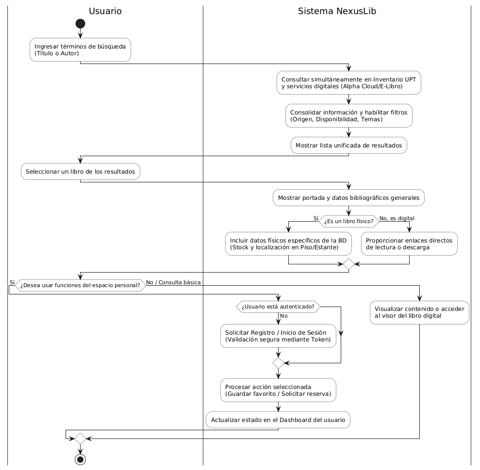

# **IV. Especificación de Requerimientos de Software** {#iv.-especificación-de-requerimientos-de-software}

## **a) Cuadro de Requerimientos No funcionales** {#a)-cuadro-de-requerimientos-no-funcionales}

| Código | Requerimiento | Descripción |
| :---- | :---- | :---- |
| **RNF-01** | Seguridad | El sistema debe sanear las entradas de búsqueda contra ataques de Inyección SQL y XSS. Además, debe garantizar la protección de datos mediante el cifrado de credenciales, gestión de sesiones con tokens seguros en el cliente y el bloqueo estricto del listado de directorios en el servidor. |
| **RNF-02** | Rendimiento | El sistema debe estar optimizado para que la integración entre la base de datos local y la fuente externa no afecte la velocidad de respuesta al usuario. |
| **RNF-03** | Disponibilidad | La plataforma debe estar alojada en un servidor web que permita el acceso constante desde cualquier punto de la red universitaria. |
| **RNF-04** | Usabilidad | La interfaz debe ser sencilla y clara, permitiendo que cualquier usuario pueda realizar una búsqueda exitosa sin necesidad de capacitación previa. |
| **RNF-05** | Responsividad | El frontend de la aplicación debe implementar un diseño web adaptable (responsive design), asegurando que elementos críticos como el navbar, los filtros avanzados y el Dashboard del usuario mantengan un rendimiento fluido y 100% funcional en dispositivos móviles. |

## **b) Cuadro de Requerimientos funcionales Final** {#b)-cuadro-de-requerimientos-funcionales-final}

| Código | Requerimiento | Descripción |
| :---- | :---- | :---- |
| **RF-01** | Búsqueda unificada | El sistema debe realizar consultas simultáneas en el catálogo de libros físicos (Inventario UPT) y en los servicios de libros digitales (Alpha Cloud y E-Libro), presentando los hallazgos en una lista de resultados combinada. |
| **RF-02** | Visualización de detalles | La plataforma debe mostrar la portada y los datos bibliográficos generales del libro seleccionado (aplica para libros físicos y libros digitales). En el caso exclusivo de libros físicos, se deberán incluir de forma complementaria sus datos físicos específicos extraídos de la base de datos. |
| **RF-03** | Consulta de disponibilidad y localización | El software debe mostrar en tiempo real si un libro físico se encuentra disponible o prestado según el stock registrado en MySQL, detallando de forma integrada su ubicación exacta (piso y estante) en sala si cuenta con unidades disponibles. |
| **RF-04** | Filtrado de resultados | La aplicación debe permitir organizar y refinar la lista de resultados mediante los componentes de: Criterio de Búsqueda (título, autor), Origen (Inventario UPT, E-Libro, Alpha Cloud), Disponibilidad (con stock / sin stock) y Temas (categorías). |
| **RF-05** | Acceso digital | El buscador debe proporcionar enlaces directos para la visualización o descarga de materiales en formato de libros digitales cuando las plataformas de origen lo permitan. |
| **RF-06** | Gestión de Administrador | El sistema debe habilitar un módulo centralizado para el perfil administrativo que permita: la gestión de usuarios, administrar el inventario UPT (revisar los registros de un libro y cambiar su estado de disponibilidad), y visualizar exclusivamente (modo lectura) los registros de libros guardados y las reservas de los usuarios. |
| **RF-07** | Autenticación y Registro | El sistema debe permitir a los usuarios registrarse e iniciar sesión de forma segura, controlando las sesiones mediante tokens para habilitar el acceso a su espacio personal. |
| **RF-08** | Módulo de Libros Guardados | La plataforma debe permitir a los usuarios autenticados almacenar libros físicos o digitales de su interés dentro de su espacio personal, proporcionando la capacidad de crear, gestionar y clasificar dichos recursos en carpetas o colecciones personalizadas accesibles dinámicamente desde su Dashboard. |
| **RF-09** | Módulo de Reservas | El software debe permitir a los usuarios autenticados solicitar la reserva de libros físicos con stock disponible, mostrando el estado del trámite en su panel personal. |

## **c) Reglas de Negocio** {#c)-reglas-de-negocio}

| Código | Regla de Negocio | Autoridad |
| :---- | :---- | :---- |
| **RN-01** | El sistema debe validar que el campo de búsqueda no esté vacío antes de realizar consultas a la API o base de datos. | Diseño del Sistema |
| **RN-02** | Los resultados de búsqueda deben mostrar primero la disponibilidad física local antes que los recursos externos. | Lógica del Sistema |
| **RN-03** | Un libro se marcará como "No disponible" automáticamente cuando su stock en la base de datos MySQL llegue a cero. | Lógica del Sistema |
| **RN-04** | Las búsquedas por ISBN deben normalizarse para omitir guiones o espacios, validando solo los dígitos numéricos. | Diseño del Sistema |
| **RN-05** | El acceso a la lectura en línea a través de las plataformas digitales estará condicionado a la disponibilidad que otorguen Alpha Cloud o E-Libro. | Lógica del Sistema |
| **RN-06** | Solo los usuarios registrados y autenticados con éxito podrán procesar solicitudes de reserva física o almacenar recursos en su panel de guardados. | Seguridad del Sistema |
| **RN-07** | El estado de la sesión activa del usuario deberá gestionarse y validarse mediante tokens seguros en el cliente para autorizar operaciones dentro del Dashboard. | Seguridad del Sistema |

# **V. Fase de Desarrollo** {#v.-fase-de-desarrollo}

## **1\. Perfiles de Usuario** {#1.-perfiles-de-usuario}

* **Estudiante / Investigador (Usuario)**

  El usuario principal de la aplicación web. Su función consiste en localizar material bibliográfico de manera ágil para apoyar su formación académica. Tiene acceso a la barra de búsqueda unificada para consultar libros por título, autor o ISBN, visualizando resultados híbridos (físicos y digitales). En la vista detallada puede verificar la disponibilidad en tiempo real, la ubicación exacta en sala o acceder a los enlaces de lectura en línea y descarga del recurso electrónico. Además, cuenta con un panel personal (Dashboard) para gestionar sus libros guardados y realizar el seguimiento de sus solicitudes de reserva. 

* **Bibliotecario / Administrador:**

  El usuario encargado de la gestión operativa y el mantenimiento del catálogo en el sistema. Su función principal es la administración integral de los registros bibliográficos del inventario físico local almacenados en la base de datos. Cuenta con privilegios de acceso al módulo administrativo para registrar nuevos ingresos de textos, editar metadatos y actualizar el stock físico, garantizando que la información de disponibilidad y localización en estanterías se mantenga exacta y sincronizada para las consultas del público.

## **2\. Modelo Conceptual** {#2.-modelo-conceptual}

### **a) Diagrama de Paquetes** {#a)-diagrama-de-paquetes}

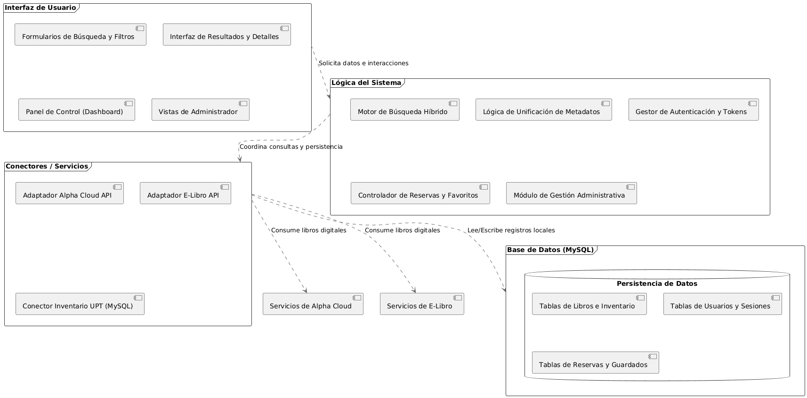

### **b) Diagrama de Casos de Uso** {#b)-diagrama-de-casos-de-uso}

### 

### **c) Escenarios de Caso de Uso (narrativa)** {#c)-escenarios-de-caso-de-uso-(narrativa)}

**Narrativa de CU01 \- Búsqueda Unificada**

| RF-01: Búsqueda unificada |  |
| ----- | ----- |
| **Tipo** | Obligatorio |
| **Actores** | Usuario, Sistema NexusLib, Servicios de Alpha Cloud y E-Libro. |
| **Descripción** | Permite al usuario realizar consultas simultáneas de metadatos en el catálogo de libros físicos de la universidad (Inventario UPT en MySQL) y en las plataformas externas de libros digitales (Alpha Cloud y E-Libro), consolidando los hallazgos en una única interfaz. |
| **Historia de Usuario** | Como estudiante, quiero realizar una búsqueda única en una sola barra por título o autor, para encontrar libros físicos y digitales al mismo tiempo sin tener que navegar por múltiples plataformas. |
| **Escenario (Gherkin)** | **Dado** que el usuario se encuentra en la interfaz de búsqueda principal, **Cuando** ingresa un término de búsqueda (título o autor) en la barra de consultas y presiona el botón "Buscar", **Entonces** el sistema debe presentar una lista unificada y combinada con los resultados obtenidos del inventario local (MySQL) y las respuestas normalizadas de Alpha Cloud y E-Libro. |
| **Precondiciones** | El sistema debe contar con conectividad activa a internet para enlazar con los microservicios y consumir de forma segura las APIs de los proveedores digitales remotos. |
| **Narrativa de cada de uso** |  |
| **Acción del usuario** | **Respuesta del sistema** |
| **1\.** El usuario ingresa un término de consulta (título o autor) en la barra de búsqueda principal.  |  |
| **2\.** El usuario presiona el botón de "Buscar" o la tecla Enter para confirmar y enviar la solicitud.  | **3\.** El servicio orquestador (gateway-service) recibe el parámetro y activa la exploración simultánea y concurrente en la base de datos MySQL local y en los microservicios de libros digitales (alpha-service y elibro-service). |
|  | **4\.** El sistema procesa los flujos de datos heterogéneos recibidos, normaliza los metadatos bajo un mismo objeto de dominio y depura la colección para eliminar posibles registros duplicados.  |
|  | **5\.** El sistema organiza los hallazgos devueltos, indexando los estados iniciales de disponibilidad para estructurar correctamente la respuesta del catálogo.  |
|  | **6\.** El sistema despliega la lista combinada y unificada de resultados finales en la interfaz gráfica del usuario.  |

**Narrativa de CU02 \- Visualización de Detalles**

| RF-02: Visualización de detalles |  |
| ----- | ----- |
| **Tipo** | Obligatorio |
| **Actores** | Usuario, Sistema NexusLib, Servicios de Alpha Cloud y E-Libro. |
| **Descripción** | Permite al usuario visualizar la ficha técnica detallada de un libro seleccionado. El sistema unifica la portada y los metadatos bibliográficos generales (tanto para libros físicos como digitales), incorporando de forma complementaria la localización y stock en tiempo real únicamente si corresponde a un libro físico del inventario UPT. |
| **Historia de Usuario** | Como usuario, quiero ver la ficha técnica completa y la portada del libro seleccionado, para determinar si el recurso es relevante para mi trabajo académico y conocer su formato de disponibilidad. |
| **Escenario (Gherkin)** | **Dado** que el usuario ha obtenido una lista de resultados de búsqueda, **Cuando** hace clic sobre un libro específico de la lista, **Entonces** el sistema debe desplegar la portada y los datos bibliográficos generales del libro seleccionado, incluyendo de forma exclusiva los datos físicos específicos extraídos de la base de datos si el recurso se encuentra físicamente en la biblioteca. |
| **Precondiciones** | El usuario debe haber realizado una búsqueda previa y seleccionado un elemento activo de la lista de resultados en pantalla. |
| **Narrativa de cada de uso** |  |
| **Acción del usuario** | **Respuesta del sistema** |
| **1\.** El usuario hace clic sobre un libro específico en la lista de resultados unificada.  | **2\.** El sistema identifica el recurso seleccionado mediante su identificador único y determina si corresponde a un libro físico o digital.  |
|  | **3\.** El sistema recupera de manera eficiente la portada y los metadatos bibliográficos generales desde el microservicio que procesó el origen del recurso (alpha-service, elibro-service o inventory-service). |
|  | **4\.** En caso exclusivo de tratarse de un libro físico, el sistema ejecuta una consulta complementaria en la base de datos MySQL para extraer sus datos físicos específicos. |
| **5\.** El usuario visualiza la información técnica estructurada del recurso en la interfaz gráfica.  | **6\.** El sistema presenta la ficha activa en pantalla, habilitando de forma dinámica los botones de acceso digital (lectura/descarga) o las opciones de interacción del panel personal para libros físicos.  |

**Narrativa de CU03 \- Consulta de Disponibilidad y Localización**

| RF-03: Consulta de Disponibilidad y Localización |  |
| ----- | ----- |
| **Tipo** | Obligatorio |
| **Actores** | Usuario, Sistema NexusLib |
| **Descripción** | Permite al usuario verificar en tiempo real si un libro físico se encuentra disponible o prestado según el stock registrado en MySQL. Si cuenta con unidades disponibles, el sistema detalla de forma integrada su ubicación exacta (piso y estante) e instrucciones de guía para encontrarlo en la sala. |
| **Historia de Usuario** | Como usuario, quiero conocer la disponibilidad real y la ubicación de un libro físico, para encontrarlo directamente en la sala o evitar traslados innecesarios si el ejemplar no está en estante. |
| **Escenario (Gherkin)** | **Dado** que el usuario visualiza los detalles de un libro físico, **Cuando** el sistema consulta el stock y la localización en tiempo real en la base de datos local, **Entonces** la interfaz debe mostrar la cantidad de ejemplares disponibles junto con su piso y estante, o el mensaje "Sin stock actual" si las unidades están en cero. |
| **Precondiciones** | El libro debe existir registrado como un ejemplar físico en la base de datos institucional MySQL. |
| **Narrativa de cada de uso** |  |
| **Acción del usuario** | **Respuesta del sistema** |
| **1\.** El usuario accede a la sección de estado dentro de la ficha detallada del libro físico.  | **2\.** El sistema (inventory-service) ejecuta una consulta en tiempo real a los campos de stock, piso y estante en la base de datos MySQL.  |
|  | **3\.** El sistema valida si la cantidad de ejemplares en el inventario es superior a cero.  |
|  | **4\.** Si hay unidades, el sistema extrae las coordenadas de sala y genera un mensaje de orientación textual; de lo contrario, prepara el aviso "Sin stock actual".  |
| **5\.** El usuario observa de forma integrada el indicador de disponibilidad y los datos de localización en la interfaz.  |  |

**Narrativa de CU04 \- Filtrado de Resultados**

| RF-04: Filtrado de resultados |  |
| ----- | ----- |
| **Tipo** | Obligatorio |
| **Actores** | Usuario, Sistema NexusLib |
| **Descripción** | Permite al usuario refinar, organizar y segmentar la lista de resultados unificada mediante componentes específicos de control: Criterio de Búsqueda (título o autor), Origen (Inventario UPT, E-Libro o Alpha Cloud), Disponibilidad (con stock o sin stock) y Temas (categorías). |
| **Historia de Usuario** | Como usuario, quiero aplicar filtros dinámicos por origen, disponibilidad y categorías a los resultados, para reducir el catálogo a los libros específicos que se ajusten a mis necesidades académicas inmediatas. |
| **Escenario (Gherkin)** | **Dado** que el sistema muestra una lista de resultados unificada en pantalla, **Cuando** el usuario interactúa con los componentes de filtrado (Criterio de Búsqueda, Origen, Disponibilidad o Temas), **Entonces** la plataforma debe actualizar de forma inmediata la interfaz, mostrando exclusivamente aquellos registros que cumplan con los parámetros seleccionados. |
| **Precondiciones** | El usuario debe contar con una lista activa de resultados de búsqueda en la pantalla. |
| **Narrativa de cada de uso** |  |
| **Acción del usuario** | **Respuesta del sistema** |
| **1\.** El usuario interactúa con el componente "Origen" seleccionando una fuente específica (Inventario UPT, E-Libro o Alpha Cloud).  | **2\.** El sistema procesa la colección de datos en pantalla y oculta de forma dinámica aquellos registros que no provengan del proveedor seleccionado.  |
| **3\.** El usuario cambia el estado en el componente "Disponibilidad" (con stock / sin stock).  | **4\.** El sistema filtra los libros físicos locales según su existencia en la base de datos MySQL, actualizando visualmente la grilla de resultados.  |
| **5\.** El usuario selecciona un criterio específico en el componente "Temas" (categorías) o ajusta el "Criterio de Búsqueda" (título o autor).  | **6\.** El sistema reorganiza los elementos bibliográficos y renderiza la lista final filtrada en la interfaz gráfica del usuario.  |

**Narrativa de CU05 \- Acceso Digital**

| RF-05: Acceso digital |  |
| ----- | ----- |
| **Tipo** | Obligatorio |
| **Actores** | Usuario, Sistema NexusLib, Servicios de Alpha Cloud y E-Libro. |
| **Descripción** | Proporciona al usuario enlaces directos para la visualización o descarga de materiales en formato de libros digitales cuando las plataformas externas de origen (Alpha Cloud o E-Libro) lo permitan. |
| **Historia de Usuario** | Como usuario, quiero acceder a los enlaces de redirección digital, para consultar el contenido del libro de manera inmediata desde cualquier ubicación con conexión a internet. |
| **Escenario (Gherkin)** | **Dado** que el libro digital seleccionado cuenta con una versión electrónica disponible en los proveedores, **Cuando** el usuario presiona el botón "Recurso Digital" dentro de la sección de detalles, **Entonces** el sistema debe abrir automáticamente una nueva pestaña en el navegador con el visor interactivo o el enlace de descarga directa correspondiente. |
| **Precondiciones** | El recurso seleccionado debe contar con una URL de acceso válida y activa suministrada por los microservicios alpha-service o elibro-service. |
| **Narrativa de cada de uso** |  |
| **Acción del usuario** | **Respuesta del sistema** |
| **1\.** El usuario identifica y hace clic en el botón de "Leer Vista Previa" de un libro digital dentro de la lista de resultados de búsqueda.  | **2\.** El sistema procesa la solicitud y redirecciona al usuario a la vista de detalles del libro digital seleccionado.  |
| **3\.** El usuario presiona el botón de "Recurso Digital" dentro de la sección de detalles del libro.  | **4\.** El sistema orquesta la petición a través del gateway-service y abre automáticamente una nueva pestaña en el navegador con el visor o la URL de origen de la plataforma correspondiente (Alpha Cloud o E-Libro). |

**Narrativa de CU06 \- Gestion de Administrador**

| RF-06: Gestion de Administrador |  |
| ----- | ----- |
| **Tipo** | Obligatorio |
| **Actores** | Administrador, Sistema NexusLib. |
| **Descripción** | Habilita un panel de control centralizado y protegido para el Administrador. Desde este módulo puede gestionar las cuentas de usuario, actualizar el inventario UPT (revisar registros de libros físicos y cambiar su estado de disponibilidad en tiempo real), y supervisar de forma pasiva (modo lectura estricto) los registros de libros guardados y las solicitudes de reservas tramitadas por los usuarios. |
| **Historia de Usuario** | Como Administrador, quiero acceder a un panel administrativo centralizado para gestionar los usuarios, controlar el catálogo local y supervisar las interacciones de libros guardados y reservas, para mantener la información de la biblioteca institucional verídica y actualizada. |
| **Escenario (Gherkin)** | **Dado** que el Administrador se encuentra autenticado con su rol correspondiente en la plataforma, **Cuando** navega por las secciones de control (Gestión de Usuarios, Inventario UPT, Guardados o Reservas), **Entonces** el sistema debe permitirle ejecutar acciones de edición/actualización sobre los usuarios y el stock físico local, mientras que para los módulos de libros guardados y reservas de los estudiantes debe restringir la vista únicamente a modo de consulta (solo lectura). |
| **Precondiciones** | El Administrador debe haber iniciado sesión con éxito y contar con un token de autorización activo de nivel administrativo. |
| **Narrativa de cada de uso** |  |
| **Acción del usuario** | **Respuesta del sistema** |
| **1\.** El Administrador accede al panel administrativo y selecciona una de las pestañas de control en el menú lateral (Gestion de Usuarios, Inventario UPT, Libros Guardados o Reservas de Usuarios).  | **2\.** El sistema (gateway-service) intercepta la petición, válida la firma del token seguro de administrador y solicita los datos específicos al microservicio correspondiente (auth-service, inventory-service o user-library-service). |
|  | **3\.** El sistema renderiza la interfaz administrativa desplegando la tabla de registros solicitada con sus respectivas herramientas de control.  |
| **4\.** En la sección de Inventario UPT, el Administrador edita el registro de un libro físico o conmuta manualmente su interruptor de disponibilidad.  | **5\.** El sistema (inventory-service) procesa el cambio en caliente, actualiza el estado de disponibilidad en la base de datos MySQL y refresca la vista enviando un mensaje de éxito. |
| **6\.** El Administrador cambia a las pestañas de Libros Guardados o Reservas de Usuarios para auditar los movimientos de la biblioteca.  | **7\.** El sistema carga los historiales transaccionales de los estudiantes en modo lectura (Read-Only), inhabilitando cualquier botón de alteración o borrado de datos para preservar la integridad del sistema.  |

**Narrativa de CU07 \- Autenticación y Registro**

| RF-07: Autenticación y Registro |  |
| ----- | ----- |
| **Tipo** | Obligatorio |
| **Actores** | Usuario, Administrador, Sistema NexusLib. |
| **Descripción** | Permite a los usuarios registrarse e iniciar sesión de forma segura en la plataforma. El sistema procesa la validación de credenciales a través del microservicio dedicado, aplicando cifrado de contraseñas, el envío de un correo electrónico de verificación para la activación de nuevas cuentas, y genera tokens seguros en el cliente para mantener el estado de la sesión activa y autorizar interacciones protegidas. |
| **Historia de Usuario** | Como usuario, quiero registrarme (confirmando mi correo) e iniciar sesión de forma segura en la plataforma, para habilitar el acceso a mi espacio personal (Dashboard) y poder gestionar mis reservas y libros guardados. |
| **Escenario (Gherkin)** | **Dado** que el usuario se encuentra en la interfaz de login o registro de la aplicación, **Cuando** ingresa sus credenciales válidas (correo y contraseña) y envía el formulario correspondiente, **Entonces** el sistema debe verificar los datos en la base de datos, despachar un correo de verificación en caso de ser un registro nuevo, emitir un token seguro de autenticación en el cliente al iniciar sesión y redirigir al usuario a su panel de control personalizado según su rol. |
| **Precondiciones** | El microservicio de autenticación (auth-service) debe estar completamente operativo, con el servicio de mensajería de correo activo, y conectado a la base de datos MySQL de usuarios. |
| **Narrativa de cada de uso** |  |
| **Acción del usuario** | **Respuesta del sistema** |
| **1\.** El usuario selecciona la opción de "Iniciar Sesión" o "Registrarse" en el navbar de la aplicación.  | **2\.** El sistema carga de forma responsiva la vista del formulario solicitado (login/registro), requiriendo el ingreso de correo electrónico y contraseña. |
| **3\.** El usuario digita sus datos de acceso y hace clic en el botón de confirmación. | **4\.** El sistema (auth-service) intercepta la petición, sanea las entradas de texto contra ataques maliciosos y procesa los datos en MySQL. En caso de registro, despacha automáticamente un correo de verificación para activar la cuenta; en caso de login, valida las credenciales aplicando algoritmos de hash seguro. |
|  | **5\.** Una vez verificado el correo (para registros nuevos) o validadas las credenciales con éxito (para inicio de sesión), el sistema genera un token seguro de sesión en el cliente para autorizar futuras peticiones web.  |
|  | **6\.** El sistema actualiza el estado de la interfaz gráfica, oculta los botones de acceso público, activa las opciones del espacio personal y redirecciona al usuario a su panel correspondiente. |

**Narrativa de CU08 \- Módulo de Libros Guardados**

| RF-08: Módulo de Libros Guardados |  |
| ----- | ----- |
| **Tipo** | Obligatorio |
| **Actores** | Usuario, Sistema NexusLib. |
| **Descripción** | Permite a los usuarios autenticados almacenar y organizar los libros físicos o digitales de su interés en carpetas o colecciones personalizadas dentro de su Dashboard. El sistema interactúa con el microservicio encargado de administrar las colecciones personales para persistir las referencias de forma única por cada cuenta de usuario. |
| **Historia de Usuario** | Como usuario, quiero guardar libros de mi interés y organizarlos en colecciones dentro de mi Dashboard, para poder acceder a sus fichas técnicas rápidamente en el futuro sin tener que realizar todo el proceso de búsqueda nuevamente. |
| **Escenario (Gherkin)** | **Dado** que el usuario ha iniciado sesión en el sistema y se encuentra visualizando la ficha de detalles de un libro, **Cuando** hace clic en el botón "Guardar en Favoritos", **Entonces** el sistema debe registrar la referencia del libro en su espacio personal, alternar el estado del botón visual a "Guardado" y habilitar el recurso para su asignación dentro de las carpetas organizacionales del panel de control. |
| **Precondiciones** | El usuario debe estar correctamente autenticado mediante un token de sesión válido y el microservicio encargado (user-library-service) debe estar en comunicación directa con la base de datos de persistencia. |
| **Narrativa de cada de uso** |  |
| **Acción del usuario** | **Respuesta del sistema** |
| **1\.** El usuario hace clic en el botón "Guardar en Favoritos" situado en la sección de detalles de un libro físico o digital.  | **2\.** El sistema (gateway-service) intercepta la petición, verifica la validez del token de sesión del cliente y transmite los datos de la solicitud al microservicio de biblioteca de usuario (user-library-service). |
|  | **3\.** El sistema ejecuta la inserción del identificador del recurso junto con el ID del usuario en la tabla de almacenamiento correspondiente en MySQL.  |
|  | **4\.** El sistema confirma el éxito de la operación al frontend y actualiza dinámicamente la interfaz, cambiando el estado visual del botón a "Guardado" para evitar duplicados.  |
| **5\.** El usuario ingresa a la pestaña de "Libros Guardados" dentro de su Dashboard personal.  | **6\.** El sistema consulta las referencias indexadas del usuario en la base de datos y renderiza la colección de favoritos y sus carpetas organizacionales en una grilla interactiva, habilitando accesos rápidos a las fichas técnicas y la opción de remover libros de la lista. |
| **7\.** El usuario crea una nueva colección u organiza sus libros guardados dentro de las carpetas personalizadas mediante modales interactivos. | **8\.** El sistema procesa de forma asíncrona la vinculación relacional en la tabla intermedia de la base de datos, actualiza dinámicamente los elementos de la interfaz y ejecuta una limpieza en cascada si un recurso principal es eliminado de favoritos. |

**Narrativa de CU09 \- Módulo de Reservas**

| RF-09: Módulo de Reservas |  |
| ----- | ----- |
| **Tipo** | Obligatorio |
| **Actores** | Usuario, Sistema NexusLib. |
| **Descripción** | Permite a los usuarios autenticados solicitar la reserva formal de libros físicos pertenecientes al inventario UPT que cuenten con stock disponible en estantería. El sistema procesa el flujo a través del microservicio de biblioteca de usuario, interactúa con el módulo de inventario para asegurar el ejemplar y despliega el estado y código del trámite en tiempo real desde el Dashboard personal. |
| **Historia de Usuario** | Como usuario, quiero solicitar la reserva de un libro físico disponible a través de la plataforma, para asegurar que el ejemplar sea separado a mi nombre antes de acercarme físicamente a recogerlo a la biblioteca de la universidad. |
| **Escenario (Gherkin)** | **Dado** que el usuario ha iniciado sesión en el sistema y se encuentra en la vista de detalles de un libro físico con stock disponible, **Cuando** hace clic en el botón "Solicitar Reserva" y confirma la operación en el mensaje emergente, **Entonces** el sistema debe registrar un nuevo trámite en estado "Pendiente" dentro de la base de datos, descontar preventivamente una unidad del stock local y listar la reserva con su respectivo código de recojo en el panel de control del usuario. |
| **Precondiciones** | El usuario debe estar autenticado mediante un token válido, el texto seleccionado debe corresponder obligatoriamente al formato de libro físico (inventario local) y su stock registrado en MySQL debe ser mayor a cero.  |
| **Narrativa de cada de uso** |  |
| **Acción del usuario** | **Respuesta del sistema** |
| **1\.** El usuario visualiza la ficha técnica de un libro físico con existencias y presiona el botón "Solicitar Reserva".  | **2\.** El sistema (gateway-service) intercepta la petición, valida la vigencia del token de sesión del cliente y delega la solicitud al microservicio de biblioteca (user-library-service). |
|  | **3\.** El sistema efectúa una comprobación concurrente de último segundo con el inventory-service para verificar que el libro físico aún cuente con stock real en la base de datos MySQL. |
|  | **4\.** Tras confirmar la disponibilidad, el sistema inserta el registro en la tabla reserved\_books.sql con estado inicial "Pendiente", genera un código de reserva único y disminuye temporalmente el stock del inventario general. |
|  | **5\.** El sistema devuelve una confirmación de éxito a la interfaz de usuario, inhabilitando futuras solicitudes duplicadas sobre el mismo texto. |
| **6\.** El usuario se dirige a la sección "Mis Reservas" dentro de su Dashboard personal para realizar el seguimiento. | **7\.** El sistema lee el historial transaccional activo del usuario y renderiza en pantalla una tarjeta informativa con el título del libro físico, la fecha de expiración de la reserva, el código de recojo y el estado del trámite. |

## **3\. Modelo Lógico** {#3.-modelo-lógico}

### **a) Análisis de Objetos** {#a)-análisis-de-objetos}

| Interfaz (Boundary) | Control | Entidad |
| :---- | :---- | :---- |
| Buscador Principal | Motor de Búsqueda Híbrido | Base de datos |
| Panel de Resultados y Filtros | Lógica de Unificación y Filtrado | Plataforma Externa Alpha Cloud |
| Vista de Detalles Físico | Adaptador de Alpha Cloud | Plataforma Externa E-Libro |
| Vista de Detalles Digital | Adaptador de E-Libro |  |
| Formulario de Autenticación y Registro | Controlador de Disponibilidad y Localización |  |
| Dashboard del Usuario | Gestor de Autenticación |  |
| Panel de Control del Administrador | Controlador de Reservas y Favoritos |  |
|  | Módulo de Gestión Administrativa |  |

### **b) Diagrama de Actividades con objetos** {#b)-diagrama-de-actividades-con-objetos}

**RF-01: Búsqueda Unificada**

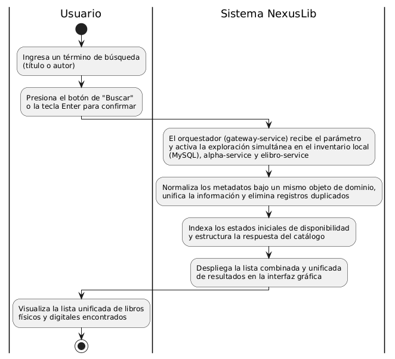

**RF-02: Visualización de Detalles**

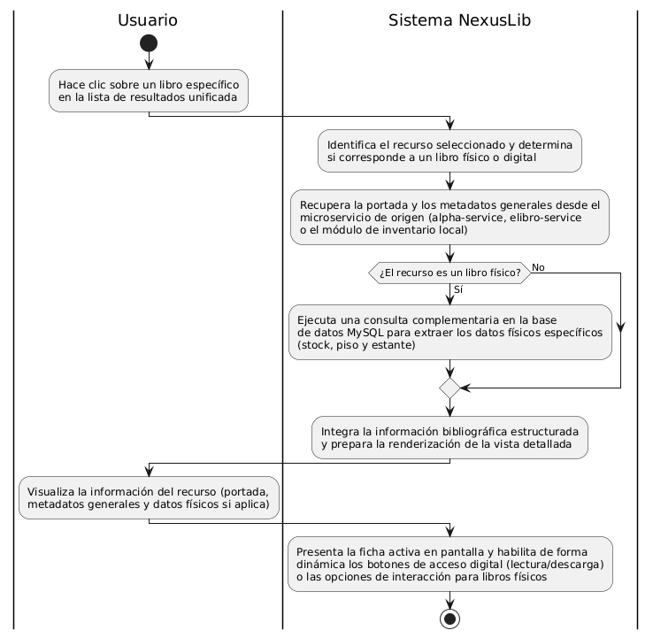

**RF-03: Consulta de Disponibilidad y Localización**

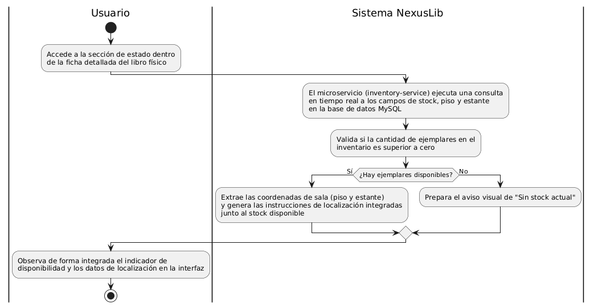

**RF-04: Filtrado de Resultados**

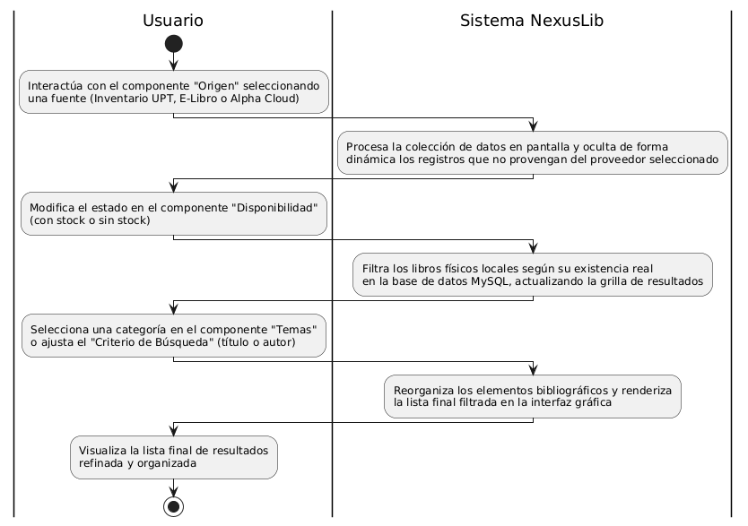

**RF-05: Acceso Digital**

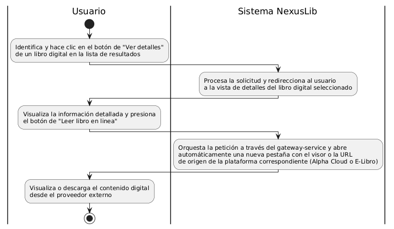

**RF-06: Gestión de Administración**

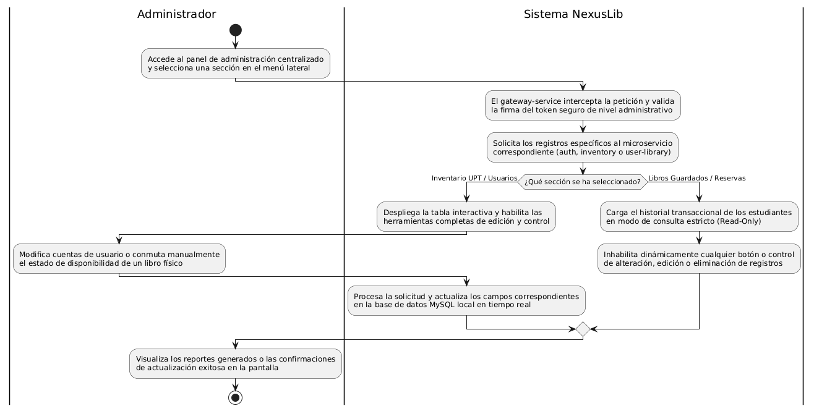

**RF-07: Autenticación y Registro**

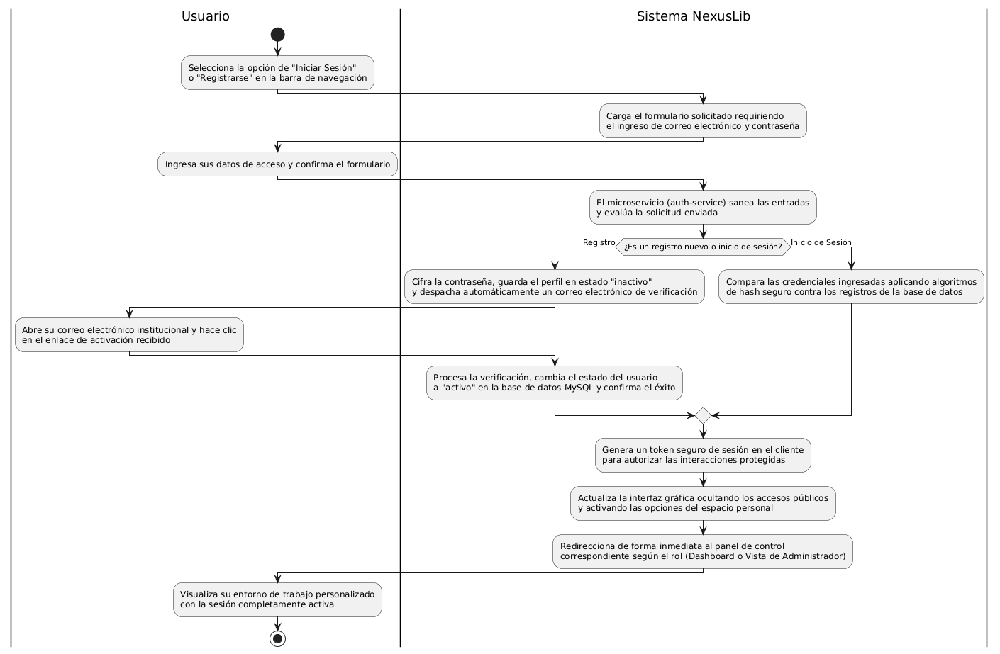

**RF-08: Módulo de Libros Guardados**

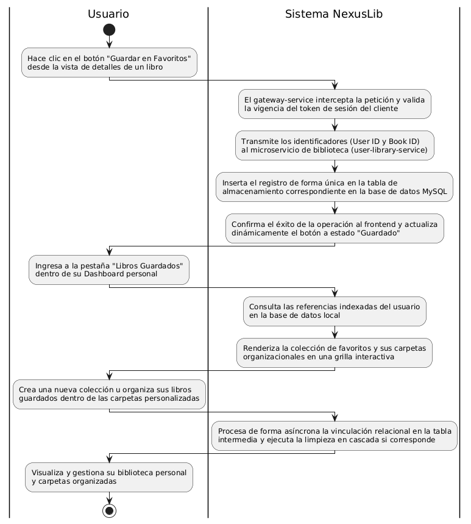

**RF-09: Módulo de Reservas**

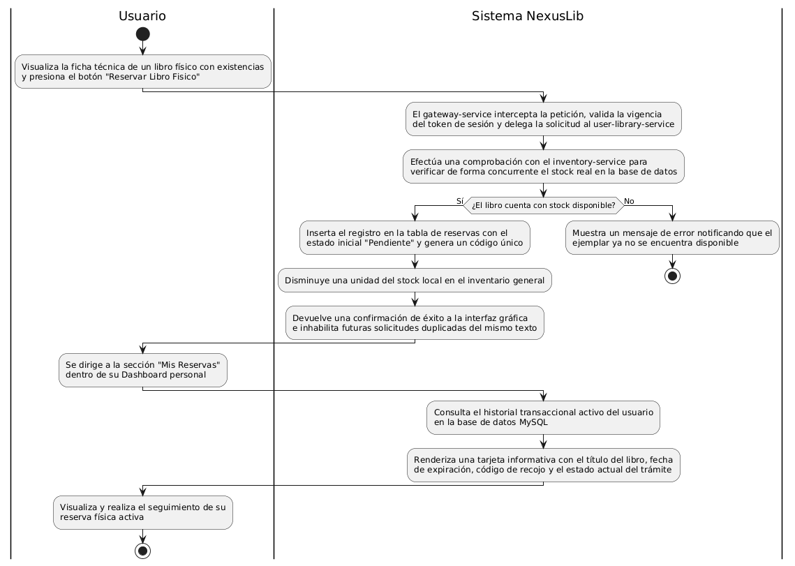

### 

### 

### **c) Diagrama de Secuencia** {#c)-diagrama-de-secuencia}

**RF-01: Búsqueda Unificada**

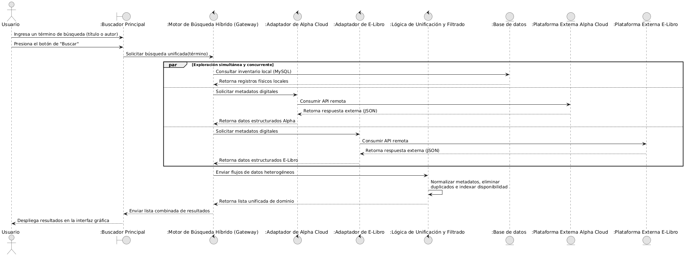

**RF-02: Visualización de Detalles**

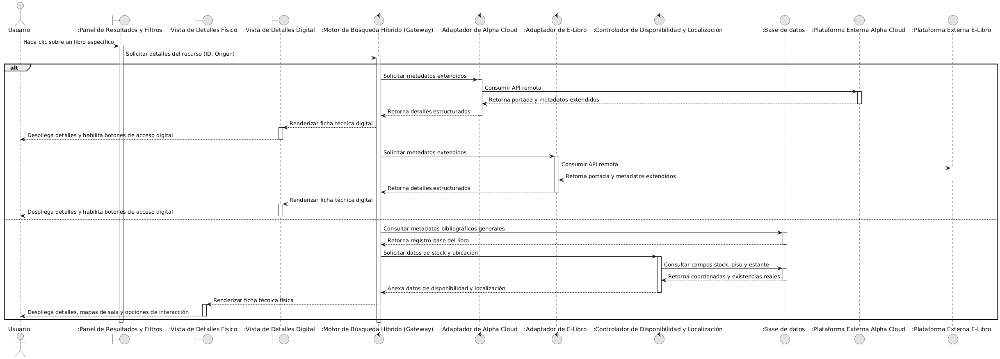

**RF-03: Consulta de Disponibilidad y Localización**

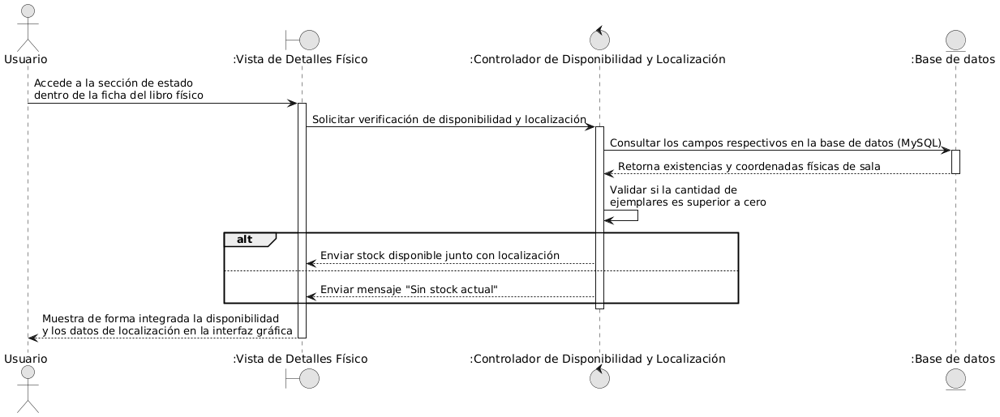

**RF-04: Filtrado de Resultados**

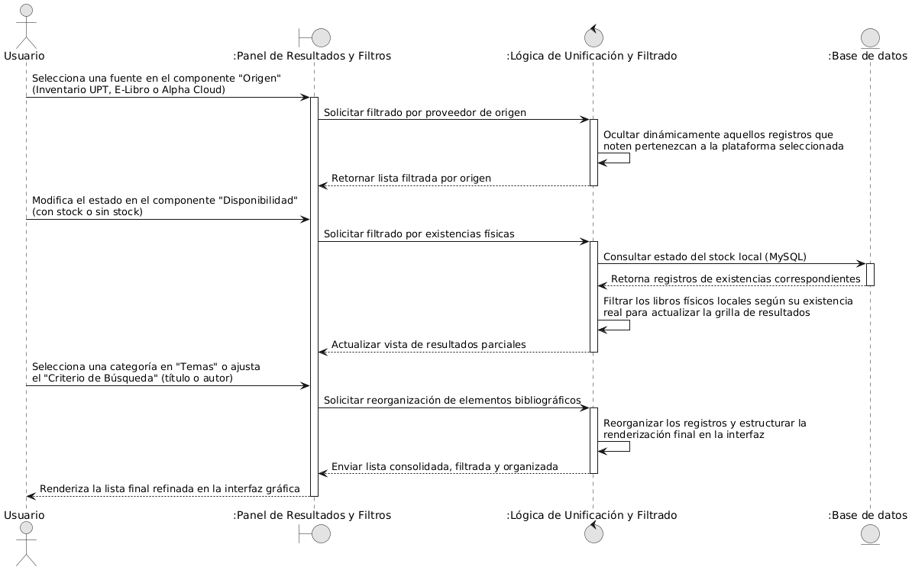

**RF-05: Acceso Digital**

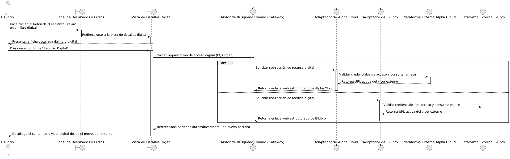

**RF-06: Gestión de Administración**

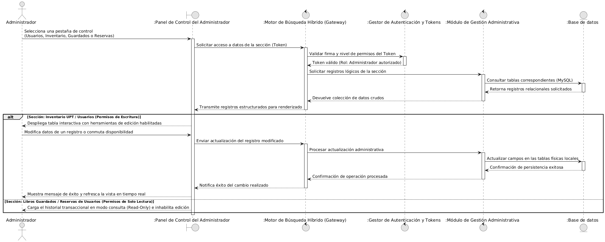

**RF-07: Autenticación y Registro**

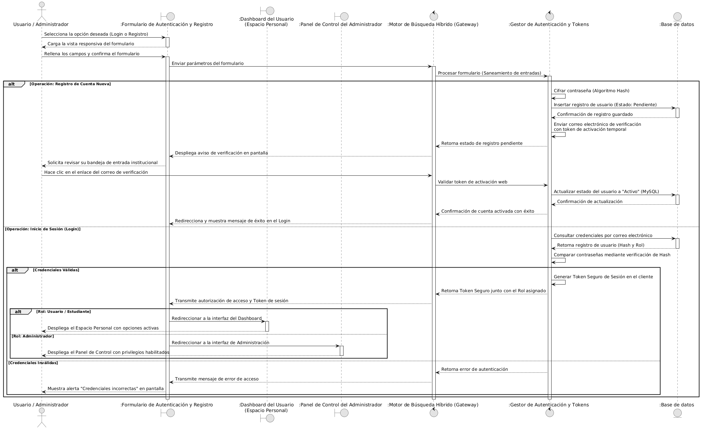

**RF-08: Módulo de Libros Guardados**

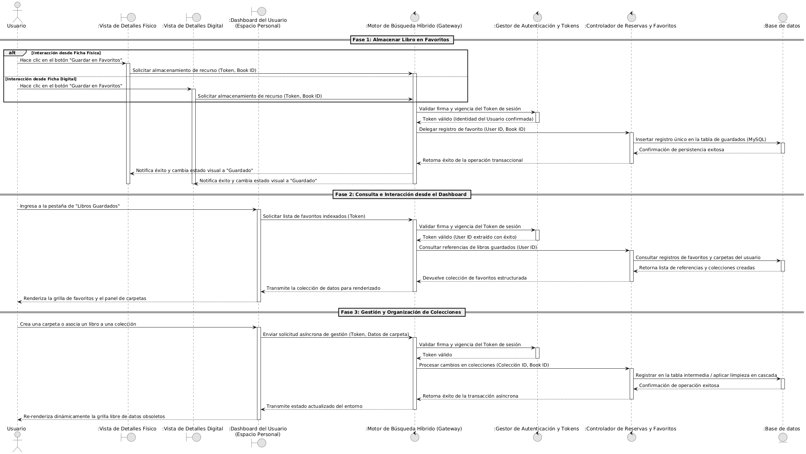

**RF-09: Módulo de Reservas**

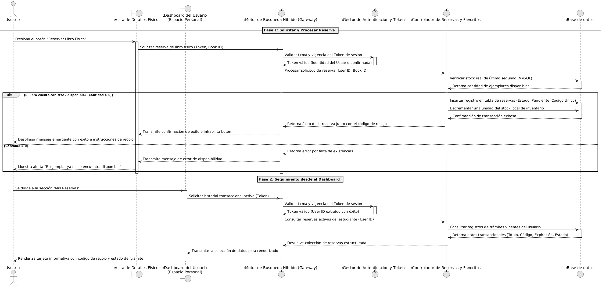

### **d) Diagrama de Clases** {#d)-diagrama-de-clases}

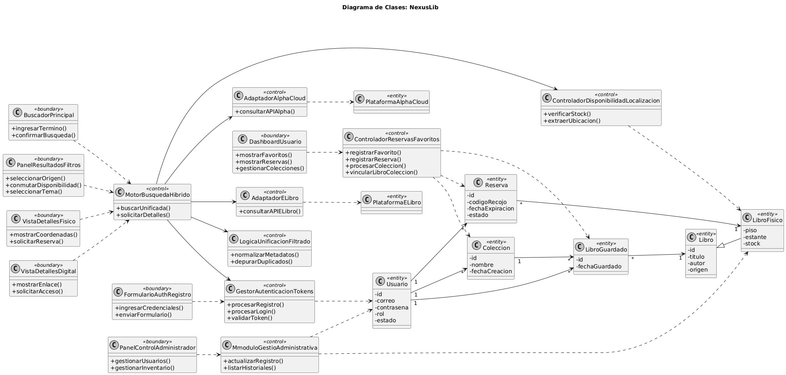

# **CONCLUSIONES** {#conclusiones}

El presente documento de Especificación de Requerimientos de Software (ERS) ha permitido estructurar de manera clara y detallada los requisitos del Sistema NexusLib, estableciendo una base sólida para su desarrollo e implementación bajo una arquitectura modular y escalable. A través del análisis del problema de fragmentación bibliográfica, la identificación de perfiles de usuario como el estudiante e investigador, y la especificación de los nueve requerimientos funcionales y cuatro no funcionales, se ha logrado definir un sistema eficiente que centraliza la oferta académica institucional. Además, la representación gráfica mediante diagramas de casos de uso, actividades con objetos, secuencia y clases ha facilitado la comprensión técnica del flujo de datos entre la interfaz de usuario, la lógica de búsqueda híbrida y la base de datos MySQL. Con esta documentación, se garantiza que el desarrollo del software esté alineado con los objetivos de modernización académica y eficiencia operativa planteados, asegurando un acceso optimizado y democrático al conocimiento para toda la comunidad universitaria.

# **RECOMENDACIONES** {#recomendaciones}

* **Escalabilidad de Fuentes:** Se recomienda continuar con la integración de nuevas APIs de repositorios académicos adicionales para expandir aún más el alcance del catálogo digital unificado.  
* **Mantenimiento Preventivo:** Es fundamental establecer un cronograma de mantenimiento preventivo para el módulo de base de datos MySQL, asegurando que la sincronización del stock y la integridad de los datos de préstamos se mantengan en tiempo real.  
* **Fomento del Consumo Digital:** Se sugiere promover el uso de las funciones de acceso digital para incrementar la tasa de consulta de los recursos ya financiados por la universidad, optimizando así el retorno de la inversión en suscripciones académicas.  
* **Monitoreo de Infraestructura:** Se recomienda monitorear constantemente el desempeño del despliegue en la infraestructura de Azure para garantizar que la plataforma mantenga los estándares de disponibilidad RNF-03 requeridos por la red universitaria.  
* **Capacitación Continua:** Aunque el sistema está diseñado para ser intuitivo (RNF-04), se recomienda realizar breves sesiones informativas con el personal bibliotecario para maximizar el uso de las herramientas de localización física y gestión de disponibilidad.

# **BIBLIOGRAFÍA** {#bibliografía}

* **Sánchez-Tarragó, N., & Alfonso-Sánchez, I. R. (2005).** *Biblioteca híbrida: el bibliotecario en medio del tránsito de lo tradicional a lo moderno*. E-LIS Repository. [http://eprints.rclis.org/6474/1/Biblioteca\_hibrida.pdf](http://eprints.rclis.org/6474/1/Biblioteca_hibrida.pdf)  
* **Guerrero-Cedeño, M., & et al. (2025).** *Sistemas integrados de gestión bibliotecaria en universidades: una revisión sistemática*. Dialnet. [https://dialnet.unirioja.es/descarga/articulo/10442413.pdf](https://dialnet.unirioja.es/descarga/articulo/10442413.pdf)  
* **Daramola, C. F. (2025).** *Exploring the impact of Digital and Physical Resources on Accessibility and Efficiency in College Libraries*. ResearchGate. [https://www.researchgate.net/publication/390300560\_Exploring\_the\_impact\_of\_Digital\_and\_Physical\_Resources](https://www.google.com/search?q=https://www.researchgate.net/publication/390300560_Exploring_the_impact_of_Digital_and_Physical_Resources)

