**UNIVERSIDAD PRIVADA DE TACNA**

**FACULTAD DE INGENIERÍA**

**Escuela Profesional de Ingeniería de Sistemas**

 **Sistema NexusLib**

Curso: Patrones de Software

Docente: Ing. Patrick Cuadros Quiroga

Integrantes:

***Hurtado Ortiz, Leandro Diego		(2015052384)***  
***Flores Navarro, Eduardo Gino		(2023076793)***  
***Cortez Mamani, Julio Samuel		(2023077283)***

**Tacna – Perú**  
**2026**

| CONTROL DE VERSIONES |  |  |  |  |  |
| :---: | :---: | :---: | :---: | :---: | ----- |
| Versión | Hecha por | Revisada por | Aprobada por | Fecha | Motivo |
| 1.0 | EGFN-JSCM | EGFN-JSCM | LDHO | 20/04/2026 | Versión Original |
| 2.0 | LDHO | LDHO | LDHO | 09/06/2026 | Versión 2.0 |
| 3.0 | LDHO | LDHO | LDHO | 18/06/2026 | Versión 3.0 |

# 

# 

# 

# 

# 

# 

# 

# 

# **Sistema NexusLib**

# **Documento de Arquitectura de Software**

# 

# **Versión 3.0**

| CONTROL DE VERSIONES |  |  |  |  |  |
| :---: | :---: | :---: | :---: | :---: | ----- |
| Versión | Hecha por | Revisada por | Aprobada por | Fecha | Motivo |
| 1.0 | EGFN-JSCM | EGFN-JSCM | LDHO | 20/04/2026 | Versión Original |
| 2.0 | LDHO | LDHO | LDHO | 09/06/2026 | Versión 2.0 |
| 3.0 | LDHO | LDHO | LDHO | 18/06/2026 | Versión 3.0 |

**ÍNDICE GENERAL**

**[1\. INTRODUCCIÓN	4](#1.-introducción)**

[1.1. Propósito (Diagrama 4+1)	4](#1.1.-propósito-\(diagrama-4+1\))

[1.2. Alcance	4](#1.2.-alcance)

[1.3. Definición, siglas y abreviaturas	4](#1.3.-definición,-siglas-y-abreviaturas)

[1.4. Organización del documento	5](#1.4.-organización-del-documento)

[**2\. OBJETIVOS Y RESTRICCIONES ARQUITECTÓNICAS	5**](#2.-objetivos-y-restricciones-arquitectónicas)

[2.1.1. Requerimientos Funcionales	5](#2.1.1.-requerimientos-funcionales)

[2.1.2. Requerimientos No Funcionales – Atributos de Calidad	7](#2.1.2.-requerimientos-no-funcionales-–-atributos-de-calidad)

[**3\. REPRESENTACIÓN DE LA ARQUITECTURA DEL SISTEMA	8**](#3.-representación-de-la-arquitectura-del-sistema)

[3.1. Vista de Caso de Uso	8](#3.1.-vista-de-caso-de-uso)

[3.1.1. Diagramas de Casos de Uso	8](#3.1.1.-diagramas-de-casos-de-uso)

[3.2. Vista Lógica	9](#3.2.-vista-lógica)

[3.2.1. Diagrama de Subsistemas (Paquetes)	9](#3.2.1.-diagrama-de-subsistemas-\(paquetes\))

[3.2.2. Diagrama de Secuencia (Vista de Diseño)	11](#3.2.2.-diagrama-de-secuencia-\(vista-de-diseño\))

[3.2.3. Diagrama de Colaboración (Vista de Diseño)	16](#3.2.3.-diagrama-de-colaboración-\(vista-de-diseño\))

[3.2.4. Diagrama de Objetos	16](#3.2.4.-diagrama-de-objetos)

[3.2.5. Diagrama de Clases	16](#3.2.5.-diagrama-de-clases)

[3.2.6. Diagrama de Base de Datos (Relacional o No Relacional)	17](#3.2.6.-diagrama-de-base-de-datos-\(relacional-o-no-relacional\))

[3.3. Vista de Implementación (Vista de Desarrollo)	17](#3.3.-vista-de-implementación-\(vista-de-desarrollo\))

[3.3.1. Diagrama de Arquitectura Software (Paquetes)	17](#3.3.1.-diagrama-de-arquitectura-software-\(paquetes\))

[3.3.2. Diagrama de Arquitectura del Sistema (Diagrama de Componentes)	18](#3.3.2.-diagrama-de-arquitectura-del-sistema-\(diagrama-de-componentes\))

[3.4. Vista de Procesos	18](#3.4.-vista-de-procesos)

[3.4.1. Diagrama de Procesos del Sistema (Diagrama de Actividad)	18](#3.4.1.-diagrama-de-procesos-del-sistema-\(diagrama-de-actividad\))

[3.5. Vista de Despliegue (Vista Física)	19](#3.5.-vista-de-despliegue-\(vista-física\))

[3.5.1. Diagrama de Despliegue	19](#3.5.1.-diagrama-de-despliegue)

[**4\. ATRIBUTOS DE CALIDAD DEL SOFTWARE	19**](#4.-atributos-de-calidad-del-software)

[Escenario de Funcionalidad	19](#escenario-de-funcionalidad)

[Escenario de Usabilidad	20](#escenario-de-usabilidad)

[Escenario de Confiabilidad	20](#escenario-de-confiabilidad)

[Escenario de Rendimiento	20](#escenario-de-rendimiento)

[Escenario de Mantenibilidad	21](#escenario-de-mantenibilidad)

[Otros Escenarios	21](#otros-escenarios)

# **1\. INTRODUCCIÓN** {#1.-introducción}

## **1.1. Propósito (Diagrama 4+1)** {#1.1.-propósito-(diagrama-4+1)}

El propósito de este documento es definir y especificar de manera clara la arquitectura de software del Sistema NexusLib, garantizando el cumplimiento de sus 9 requerimientos funcionales y asegurando atributos clave como el desacoplamiento, la concurrencia y la seguridad. Para lograrlo, se adopta el Modelo de las 4+1 Vistas de Philippe Kruchten, el cual permite estructurar y describir el ecosistema de microservicios desde cinco perspectivas de ingeniería complementarias (Casos de Uso, Lógica, Implementación, Procesos y Despliegue) orientadas a desarrolladores, analistas y evaluadores técnicos, facilitando el entendimiento integral de la plataforma.

## **1.2. Alcance** {#1.2.-alcance}

El alcance de este informe abarca el diseño técnico y la interacción de los 6 microservicios independientes que componen el ecosistema de NexusLib, detallando la capa de presentación (frontend), el orquestador central (gateway-service), los adaptadores de extracción académica (alpha-service y elibro-service), y la persistencia local en MySQL para la gestión de accesos, inventario físico y transacciones de usuario (auth-service, inventory-service y user-library-service). Quedan fuera del alcance de este análisis arquitectónico las configuraciones de redes WAN universitarias externas, la integración de pasarelas de pago de terceros o flujos lógicos correspondientes al control futuro de préstamos físicos a domicilio.

## **1.3. Definición, siglas y abreviaturas** {#1.3.-definición,-siglas-y-abreviaturas}

| Término / Sigla | Definición |
| :---- | :---- |
| **SAD** | Software Architecture Document (Documento de Arquitectura de Software). |
| **API** | Application Programming Interface (Interfaz de Programación de Aplicaciones). |
| **API Gateway** | Patrón de diseño que actúa como punto único de entrada para enrutar, orquestar y securizar las peticiones hacia los microservicios internos. |
| **Microservicio** | Enfoque arquitectónico que distribuye una aplicación como una colección de servicios independientes, altamente acoplados internamente y desplegables de forma autónoma. |
| **Scraping** | Técnica de software utilizada para extraer información y metadatos estructurados directamente desde plataformas o páginas web de manera automatizada. |
| **JWT** | JSON Web Token (Estándar abierto para la transmisión segura de identidades y tokens cifrados entre el cliente y el servidor). |
| **XAMPP** | Paquete de software libre que provee un entorno local de servidor web integrado por el servidor Apache, el motor MySQL/MariaDB y el intérprete de PHP. |
| **POO** | Programación Orientada a Objetos. |
| **MVC** | Patrón arquitectónico Modelo-Vista-Controlador. |
| **SQL** | Structured Query Language (Lenguaje de Consulta Estructurado). |
| **SOLID** | Acrónimo de cinco principios de diseño de software orientado a objetos enfocados en la mantenibilidad, escalabilidad y legibilidad del código. |
| **Facade** | Patrón de diseño estructural que proporciona una interfaz unificada y simplificada frente a un conjunto complejo de subsistemas. |
| **Adapter** | Patrón de diseño estructural que permite a interfaces incompatibles trabajar de forma conjunta traduciendo sus firmas. |
| **Strategy** | Patrón de diseño de comportamiento que permite definir una familia de algoritmos, encapsular cada uno y hacerlos intercambiables en tiempo de ejecución. |
| **DevSecOps** | Filosofía de ingeniería de software que automatiza e integra la seguridad en todas las fases del ciclo de desarrollo e infraestructura. |
| **UML** | Unified Modeling Language (Lenguaje Unificado de Modelo). |

## **1.4. Organización del documento** {#1.4.-organización-del-documento}

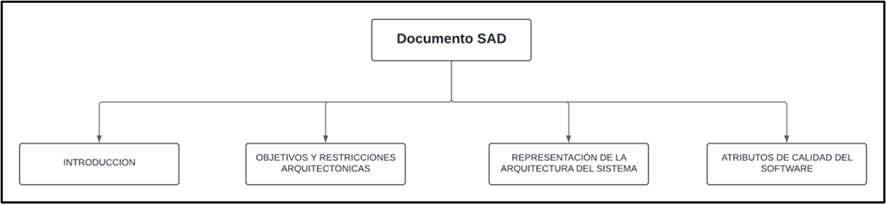

# **2\. OBJETIVOS Y RESTRICCIONES ARQUITECTÓNICAS** {#2.-objetivos-y-restricciones-arquitectónicas}

## **2.1.1. Requerimientos Funcionales** {#2.1.1.-requerimientos-funcionales}

| Código | Requerimiento | Descripción |
| :---- | :---- | :---- |
| **RF-01** | Búsqueda unificada | El sistema debe realizar consultas simultáneas en el catálogo de libros físicos (Inventario UPT) y en los servicios de libros digitales (Alpha Cloud y E-Libro), presentando los hallazgos en una lista de resultados combinada. |
| **RF-02** | Visualización de detalles | La plataforma debe mostrar la portada y los datos bibliográficos generales del libro seleccionado (aplica para libros físicos y libros digitales). En el caso exclusivo de libros físicos, se deberán incluir de forma complementaria sus datos físicos específicos extraídos de la base de datos. |
| **RF-03** | Consulta de disponibilidad y localización | El software debe mostrar en tiempo real si un libro físico se encuentra disponible o prestado según el stock registrado en MySQL, detallando de forma integrada su ubicación exacta (piso y estante) en sala si cuenta con unidades disponibles. |
| **RF-04** | Filtrado de resultados | La aplicación debe permitir organizar y refinar la lista de resultados mediante los componentes de: Criterio de Búsqueda (título, autor), Origen (Inventario UPT, E-Libro, Alpha Cloud), Disponibilidad (con stock / sin stock) y Temas (categorías). |
| **RF-05** | Acceso digital | El buscador debe proporcionar enlaces directos para la visualización o descarga de materiales en formato de libros digitales cuando las plataformas de origen lo permitan. |
| **RF-06** | Gestión de Administrador | El sistema debe habilitar un módulo centralizado para el perfil administrativo que permita: la gestión de usuarios, administrar el inventario UPT (revisar los registros de un libro y cambiar su estado de disponibilidad), y visualizar exclusivamente (modo lectura) los registros de libros guardados y las reservas de los usuarios. |
| **RF-07** | Autenticación y Registro | El sistema debe permitir a los usuarios registrarse e iniciar sesión de forma segura, controlando las sesiones mediante tokens para habilitar el acceso a su espacio personal. |
| **RF-08** | Módulo de Libros Guardados | La plataforma debe permitir a los usuarios autenticados almacenar libros físicos o digitales de su interés dentro de su espacio personal, proporcionando la capacidad de crear, gestionar y clasificar dichos recursos en carpetas o colecciones personalizadas accesibles dinámicamente desde su Dashboard. |
| **RF-09** | Módulo de Reservas | El software debe permitir a los usuarios autenticados solicitar la reserva de libros físicos con stock disponible, mostrando el estado del trámite en su panel personal. |

## **2.1.2. Requerimientos No Funcionales – Atributos de Calidad** {#2.1.2.-requerimientos-no-funcionales-–-atributos-de-calidad}

| Código | Requerimiento | Descripción |
| :---- | :---- | :---- |
| **RNF-01** | Seguridad | El sistema debe sanear las entradas de búsqueda contra ataques de Inyección SQL y XSS. Además, debe garantizar la protección de datos mediante el cifrado de credenciales, gestión de sesiones con tokens seguros en el cliente y el bloqueo estricto del listado de directorios en el servidor. |
| **RNF-02** | Rendimiento | El sistema debe estar optimizado para que la integración entre la base de datos local y la fuente externa no afecte la velocidad de respuesta al usuario. |
| **RNF-03** | Disponibilidad | La plataforma debe estar alojada en un servidor web que permita el acceso constante desde cualquier punto de la red universitaria. |
| **RNF-04** | Usabilidad | La interfaz debe ser sencilla y clara, permitiendo que cualquier usuario pueda realizar una búsqueda exitosa sin necesidad de capacitación previa. |
| **RNF-05** | Responsividad | El frontend de la aplicación debe implementar un diseño web adaptable (responsive design), asegurando que elementos críticos como el navbar, los filtros avanzados y el Dashboard del usuario mantengan un rendimiento fluido y 100% funcional en dispositivos móviles. |

# **3\. REPRESENTACIÓN DE LA ARQUITECTURA DEL SISTEMA** {#3.-representación-de-la-arquitectura-del-sistema}

## **3.1. Vista de Caso de Uso** {#3.1.-vista-de-caso-de-uso}

### **3.1.1. Diagramas de Casos de Uso** {#3.1.1.-diagramas-de-casos-de-uso}

## 

## **3.2. Vista Lógica** {#3.2.-vista-lógica}

### **3.2.1. Diagrama de Subsistemas (Paquetes)** {#3.2.1.-diagrama-de-subsistemas-(paquetes)}

**Estructura Global y Dependencias Lógicas de Subsistemas**

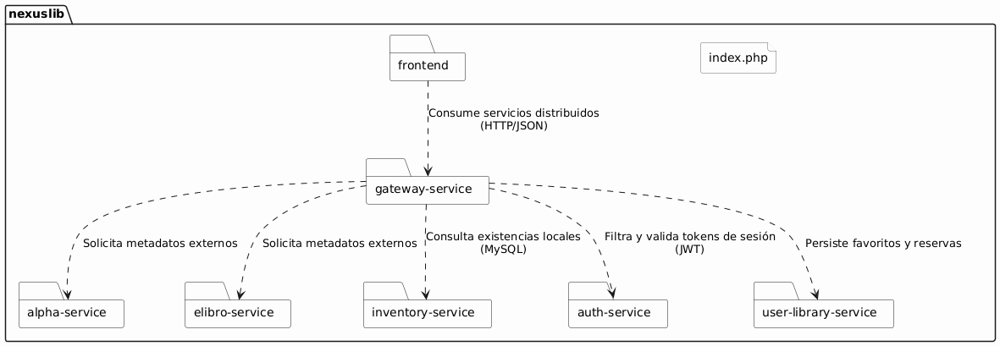

[Enlace de Imagen](https://drive.google.com/file/d/1Iuqq1qWCor1mimeA3ulKJQtSgPnavCNc/view?usp=sharing)

**Descomposición Estructural del Subsistema Frontend (Capas y Vistas)**

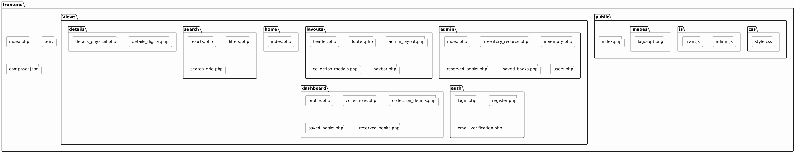

[Enlace de Imagen](https://drive.google.com/file/d/1fI60XeLMngb9x1HeQf-NUwUKx8_2Sqin/view?usp=sharing)

**Estructura de Componentes del Orquestador Central (gateway-service)** 

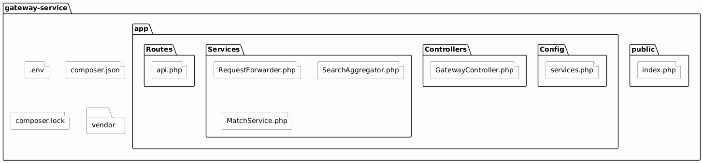

[Enlace de Imagen](https://drive.google.com/file/d/1TNFSgijXJ7Jxi92mh67Yt8Mjw_UUteSU/view?usp=sharing)

**Estructura Interna del Microservicio de Extracción de Datos (alpha-service)** 

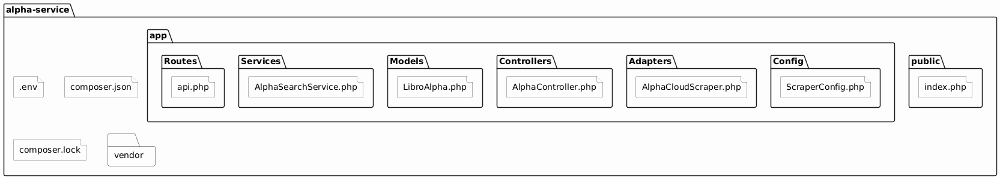

[Enlace de Imagen](https://drive.google.com/file/d/13TOAffylo5ylkWOFOfgbIFr-yjmvEnKC/view?usp=sharing)

**Estructura Interna del Microservicio de Extracción de Datos (elibro-service)** 

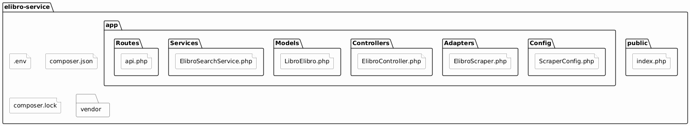

[Enlace de Imagen](https://drive.google.com/file/d/1a1IiH4sbYU4WK3rNsXe8IkQxaqkKrgqK/view?usp=sharing)

**Estructura del Microservicio de Gestión de Inventario Físico (inventory-service)** 

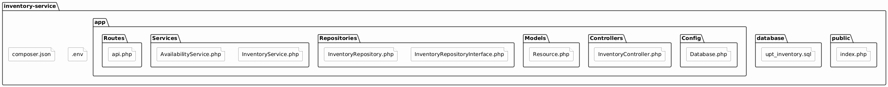

[Enlace de Imagen](https://drive.google.com/file/d/1_pEW6DSuA9ZyackuMNqig9Yu0wwjTxMj/view?usp=sharing)

**Estructura del Microservicio de Autenticación y Control de Accesos (auth-service)** 

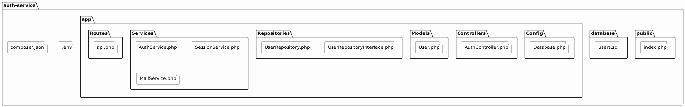

[Enlace de Imagen](https://drive.google.com/file/d/14QRPZ8Oz_tXus8fHpU-VKIFDzTNrz0GQ/view?usp=sharing)

**Estructura del Microservicio Transaccional de Biblioteca Personal (user-library-service)** 

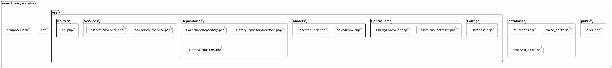

[Enlace de Imagen](https://drive.google.com/file/d/1WuycO8BjHTG-M-HUNmMwTmT1uLgqNy2n/view?usp=sharing)

### 

### **3.2.2. Diagrama de Secuencia (Vista de Diseño)** {#3.2.2.-diagrama-de-secuencia-(vista-de-diseño)}

**RF-01: Búsqueda Unificada**

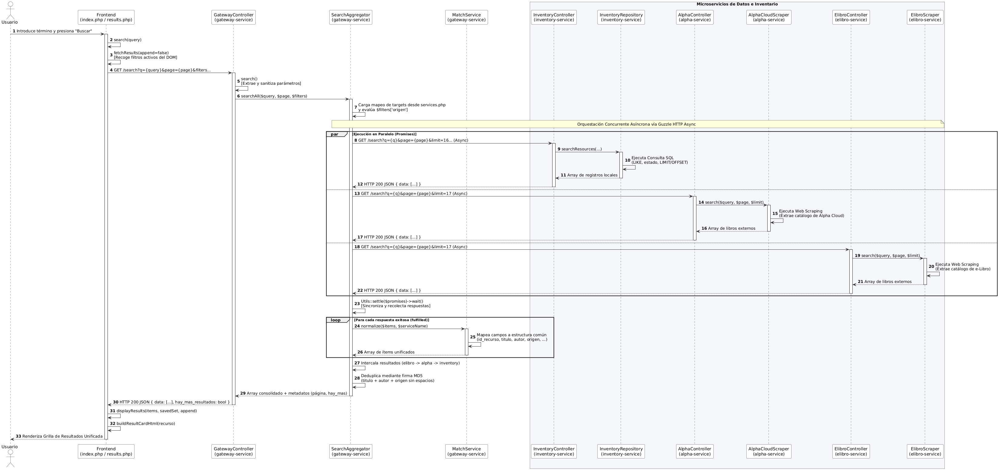

[Enlace de Imagen](https://drive.google.com/file/d/1fT2kUR95ydjIBuq7r0SgzUA4fWnzrW64/view?usp=sharing)

**RF-02: Visualización de Detalles**

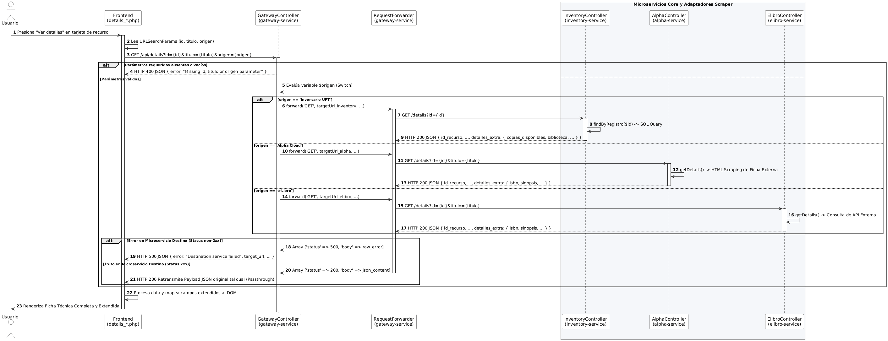

[Enlace de Imagen](https://drive.google.com/file/d/1ywwBJSuoFKHShh0dwuyEXPaMwbX_7BBk/view?usp=sharing)

**RF-03: Consulta de Disponibilidad y Localización**

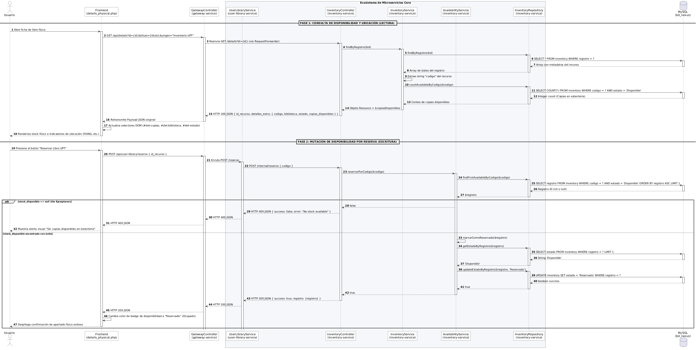

[Enlace de Imagen](https://drive.google.com/file/d/1RkqlCyIktxwaIr_Y1bLyGoDL_uWpY9dv/view?usp=sharing)

**RF-04: Filtrado de Resultados**

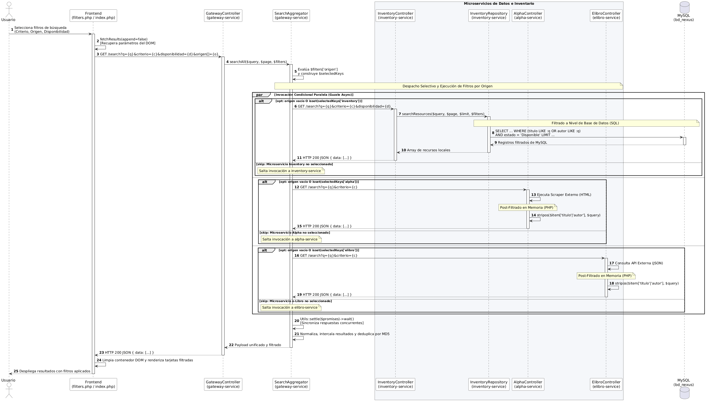

[Enlace de Imagen](https://drive.google.com/file/d/1JSTNelw-8fefWp6CSBD-hGRpHXZzitm2/view?usp=sharing)

**RF-05: Acceso Digital**

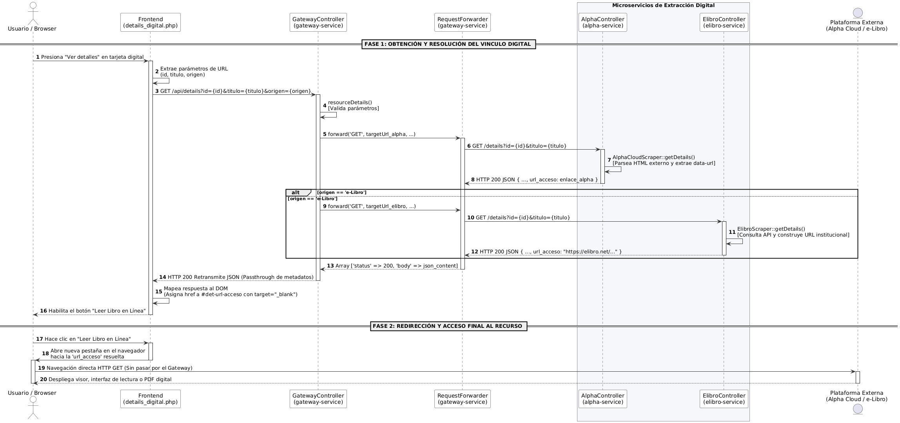

[Enlace de Imagen](https://drive.google.com/file/d/1Z194lcWQGXvdXPuQtM-5UjfObDY2VfDJ/view?usp=sharing)

**RF-06: Gestión de Administración**

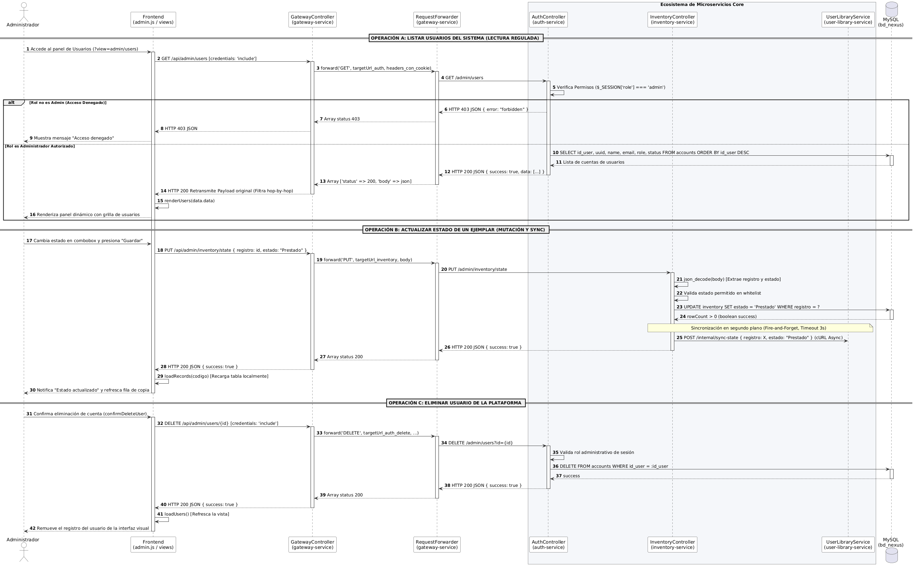

[Enlace de Imagen](https://drive.google.com/file/d/13fsDMCu7TfqGxBDP8jRYNdsNyQ09z-C1/view?usp=sharing)

**RF-07: Autenticación y Registro**

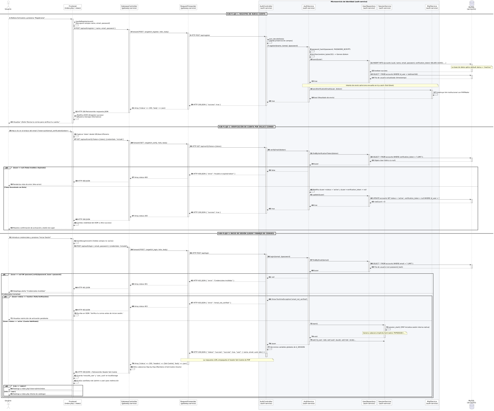

[Enlace de Imagen](https://drive.google.com/file/d/1G8CXRiMBpOwZ-S_TXxoQmOU0bstYUFZq/view?usp=sharing)

**RF-08: Módulo de Libros Guardados**

[Enlace de Imagen](https://drive.google.com/file/d/1S08LWphWLQG2xRJYtoMMJdQmEfXah26w/view?usp=sharing)

**RF-09: Módulo de Reservas**

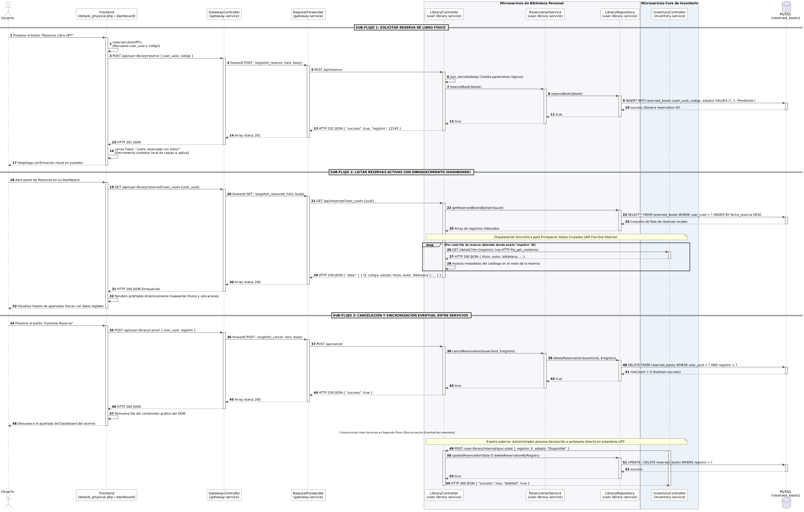

[Enlace de Imagen](https://drive.google.com/file/d/1zPhY3JADHFGa4tPrdqbOW8vDkzAdy7gU/view?usp=sharing)

### **3.2.3. Diagrama de Colaboración (Vista de Diseño)** {#3.2.3.-diagrama-de-colaboración-(vista-de-diseño)}

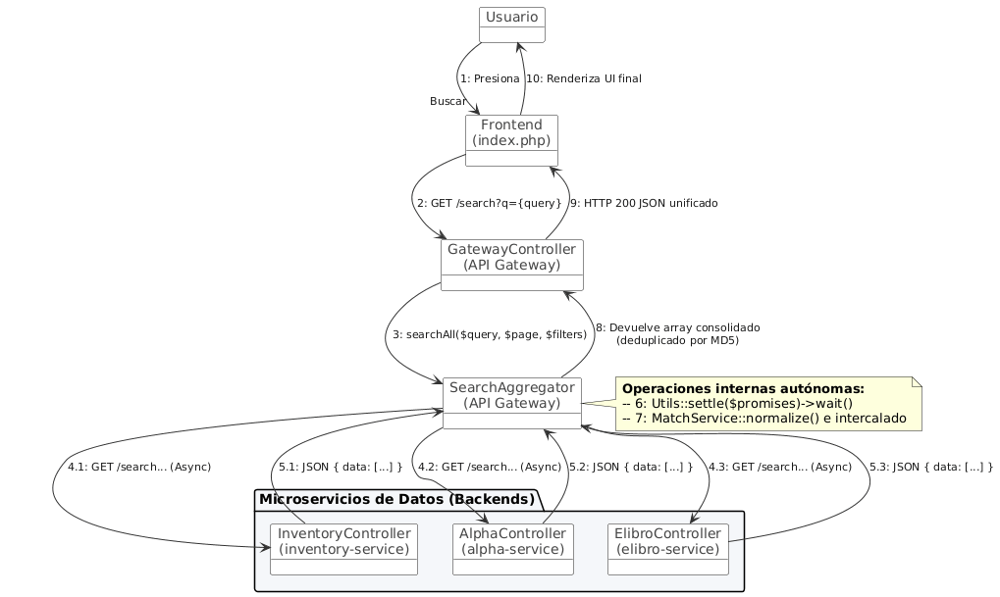

[Enlace de Imagen](https://drive.google.com/file/d/1B6EIWu8AIJZ3FYnGgLoxz3sXX7Ub4tA4/view?usp=sharing)

### **3.2.4. Diagrama de Objetos** {#3.2.4.-diagrama-de-objetos}

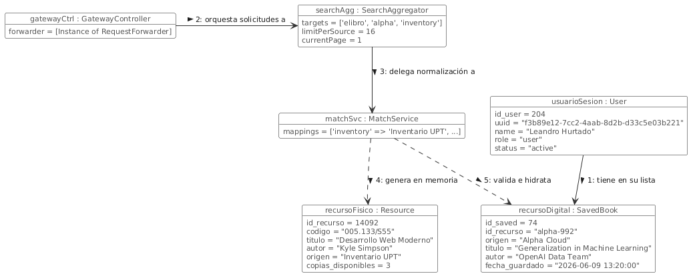

[Enlace de Imagen](https://drive.google.com/file/d/17UMAaGsmJBkL1P5SWeKHhkPETLsm9mVH/view?usp=sharing)

### **3.2.5. Diagrama de Clases** {#3.2.5.-diagrama-de-clases}

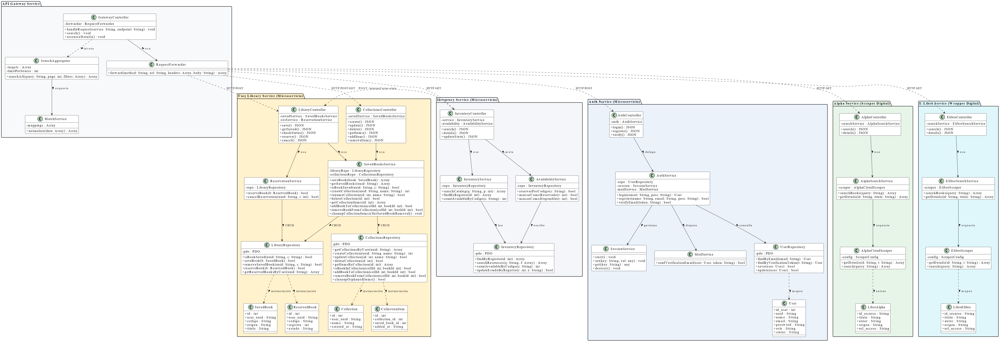

[Enlace de Imagen](https://drive.google.com/file/d/1J9HawNdtLLCOOP83qGGr_gFl3f-KpE3O/view?usp=sharing)

### **3.2.6. Diagrama de Base de Datos (Relacional o No Relacional)** {#3.2.6.-diagrama-de-base-de-datos-(relacional-o-no-relacional)}

## **3.3. Vista de Implementación (Vista de Desarrollo)** {#3.3.-vista-de-implementación-(vista-de-desarrollo)}

### **3.3.1. Diagrama de Arquitectura Software (Paquetes)** {#3.3.1.-diagrama-de-arquitectura-software-(paquetes)}

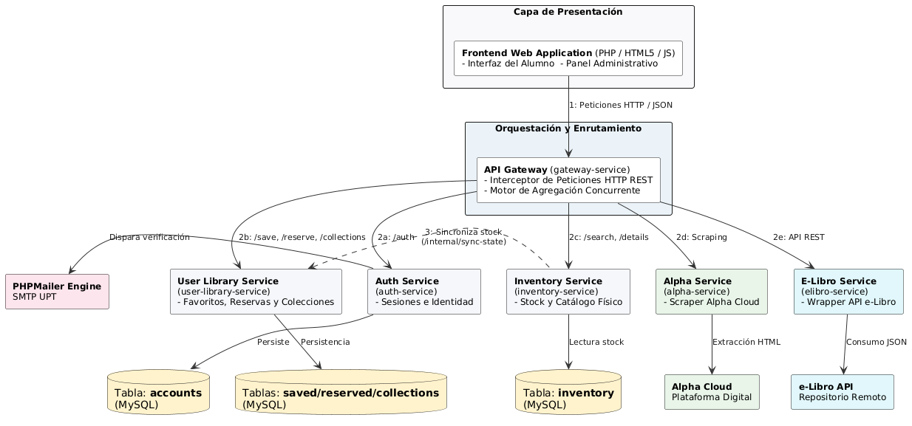

[Enlace de Imagen](https://drive.google.com/file/d/1yFgjgZH5KzeIHwdmonnXqytTbn_GCnpn/view?usp=sharing)

### **3.3.2. Diagrama de Arquitectura del Sistema (Diagrama de Componentes)** {#3.3.2.-diagrama-de-arquitectura-del-sistema-(diagrama-de-componentes)}

[Enlace de Imagen](https://drive.google.com/file/d/1C8ANPwl1rpq_mRAQ9f83elIQwE2QNh6t/view?usp=sharing)

## **3.4. Vista de Procesos** {#3.4.-vista-de-procesos}

### **3.4.1. Diagrama de Procesos del Sistema (Diagrama de Actividad)** {#3.4.1.-diagrama-de-procesos-del-sistema-(diagrama-de-actividad)}

## **3.5. Vista de Despliegue (Vista Física)** {#3.5.-vista-de-despliegue-(vista-física)}

### **3.5.1. Diagrama de Despliegue** {#3.5.1.-diagrama-de-despliegue}

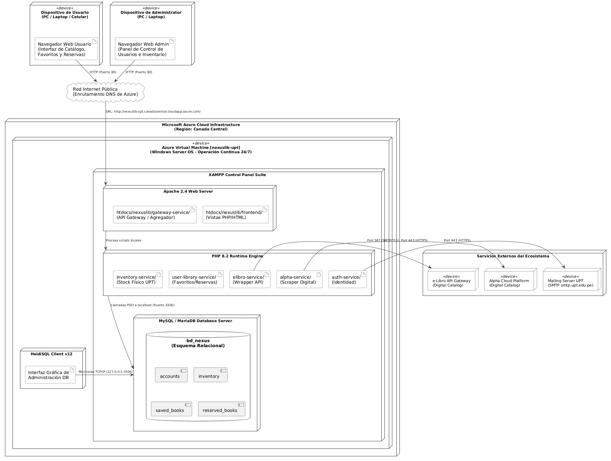

[Enlace de Imagen](https://drive.google.com/file/d/1pkWKvbrUu69SpjrpVL3HUVpx_20FtXaA/view?usp=sharing)

# **4\. ATRIBUTOS DE CALIDAD DEL SOFTWARE** {#4.-atributos-de-calidad-del-software}

## **Escenario de Funcionalidad** {#escenario-de-funcionalidad}

**Escenario:** Búsqueda unificada de recursos bibliográficos

* **Situación:** Un usuario desea buscar información sobre un tema específico para ver qué opciones físicas y digitales tiene disponibles en la universidad.  
* **Actor:** Usuario  
* **Evento disparador:** El usuario ingresa el nombre de un tema o libro en el buscador principal y presiona el botón "Buscar".  
* **Respuesta esperada:** El sistema procesa la solicitud y muestra en una sola pantalla todos los resultados encontrados, integrando los libros físicos de la facultad y los textos de las plataformas digitales.

## 

## 

## 

## **Escenario de Usabilidad** {#escenario-de-usabilidad}

**Escenario:** Interacción intuitiva para la gestión de favoritos

* **Situación:** Un usuario utiliza la plataforma web por primera vez para organizar sus lecturas de estudio.  
* **Actor:** Usuario  
* **Evento disparador:** El usuario localiza un libro digital y selecciona la opción de guardarlo en su lista personal de favoritos.  
* **Respuesta esperada:** La interfaz responde de manera inmediata cambiando visualmente el estado del botón a "Guardado", permitiendo que el usuario entienda la acción al instante y sin experimentar confusión.

## **Escenario de Confiabilidad** {#escenario-de-confiabilidad}

**Escenario:** Acceso estable al historial y reservas de libros

* **Situación:** Un usuario necesita verificar qué libros físicos tiene apartados antes de dirigirse a la biblioteca de la universidad.  
* **Actor:** Usuario  
* **Evento disparador:** El usuario inicia sesión en la plataforma y accede a su panel personal de reservas activas.  
* **Respuesta esperada:** El sistema se encuentra completamente disponible en línea, carga la información solicitada de forma correcta y no presenta fallos ni caídas durante la consulta del alumno.

## **Escenario de Rendimiento** {#escenario-de-rendimiento}

**Escenario:** Carga fluida de los resultados de búsqueda combinados

* **Situación:** Un usuario realiza una consulta general en el buscador en una hora de alta concurrencia académica en el campus.  
* **Actor:** Usuario  
* **Evento disparador:** El usuario ingresa un término de búsqueda amplio y aplica filtros específicos para refinar los resultados.  
* **Respuesta esperada:** El sistema recopila los datos y muestra la lista unificada de libros de manera rápida y eficiente, sin generar demoras ni pantallas congeladas que afecten la experiencia del estudiante.

## 

## 

## 

## **Escenario de Mantenibilidad** {#escenario-de-mantenibilidad}

**Escenario:** Actualización o mejora del sistema por nuevos catálogos

* **Situación:** Se requiere añadir una nueva fuente de libros digitales o realizar ajustes estéticos en la plataforma web.  
* **Actor:** Equipo de desarrollo  
* **Evento disparador:** Implementación de mejoras visuales en las tarjetas de presentación de los libros o corrección de enlaces.  
* **Respuesta esperada:** La organización del sistema permite aplicar estas modificaciones de manera sencilla, asegurando que los usuarios continúen utilizando sus funciones de siempre sin sufrir interrupciones en el servicio.

## **Otros Escenarios** {#otros-escenarios}

**Escenario de Escalabilidad:**

* **Situación:** Incrementa notablemente la cantidad de alumnos que se registran y realizan apartados simultáneamente al inicio del ciclo académico.  
* **Actor:** Sistema / Usuarios  
* **Evento disparador:** Un alto volumen de usuarios interactúa con el buscador y el panel al mismo tiempo.  
* **Respuesta esperada:** El sistema continúa operando correctamente y mantiene su fluidez, respondiendo eficientemente a la alta demanda progresiva sin degradar la velocidad de las consultas.

